# AgentNexus API 文档

> 企业级多智能体任务协同 CLI — 每一条命令的实现原理、执行链路与核心代码。

---

## 一、系统架构总览

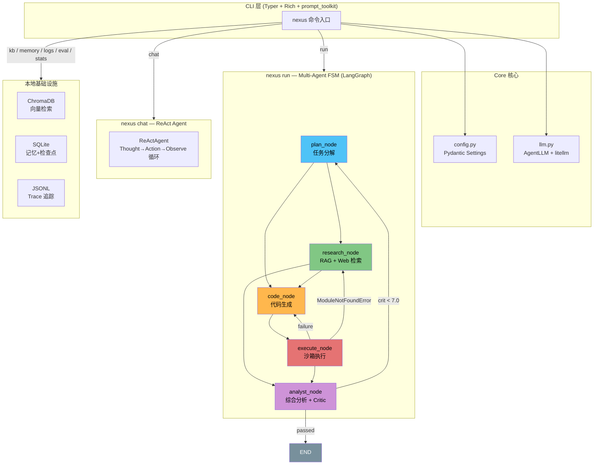

## 二、CLI 入口与初始化

### 2.1 入口点链

```
终端执行 nexus <command>
       │
       ▼
pyproject.toml  [project.scripts]
  nexus = "agentnexus.cli:app"
       │
       ▼
agentnexus/cli/__init__.py
  app = typer.Typer(name="nexus")
  kb_app / memory_app / logs_app / eval_app ← 子命令组
       │
       ▼
agentnexus/__main__.py (python -m 模式 / PyInstaller)
  from agentnexus.cli import app
  app()
```

**核心代码** (`cli/__init__.py`):

```python
app = typer.Typer(name="nexus", help="AgentNexus - 多智能体任务协同 CLI")
console = Console()

# 四个子命令组
kb_app = typer.Typer(help="知识库管理")      # → nexus kb ...
memory_app = typer.Typer(help="记忆管理")      # → nexus memory ...
logs_app = typer.Typer(help="历史 Trace 查看") # → nexus logs ...
eval_app = typer.Typer(help="RAG 评估")        # → nexus eval ...

# 延迟导入，避免启动时加载所有模块
from agentnexus.cli import run, chat, kb, memory_cmd, logs, eval_cmd, stats, config
```

### 2.2 配置加载链路

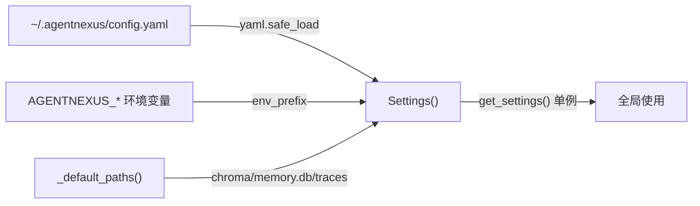

**优先级**: YAML 文件 > 环境变量 (`AGENTNEXUS_*`) > Pydantic 默认值。

```python
class Settings(BaseSettings):
    model_config = SettingsConfigDict(env_prefix="AGENTNEXUS_", extra="ignore")

    llm_api_key: SecretStr = Field(default=SecretStr(""))
    llm_model_id: str = Field(default="deepseek/deepseek-v4-flash")
    llm_base_url: str = Field(default="https://api.deepseek.com")
    llm_timeout: int = Field(default=60, ge=1)
    # ... 11 个配置项
```

---

## 三、`nexus run` — 多智能体编排

### 3.1 概述

`nexus run "<任务描述>"` 是系统核心命令，启动完整的 LangGraph 有限状态机。

**调用方式**: `nexus run "搜索 AI 趋势并写分析报告"`

### 3.2 完整执行链路

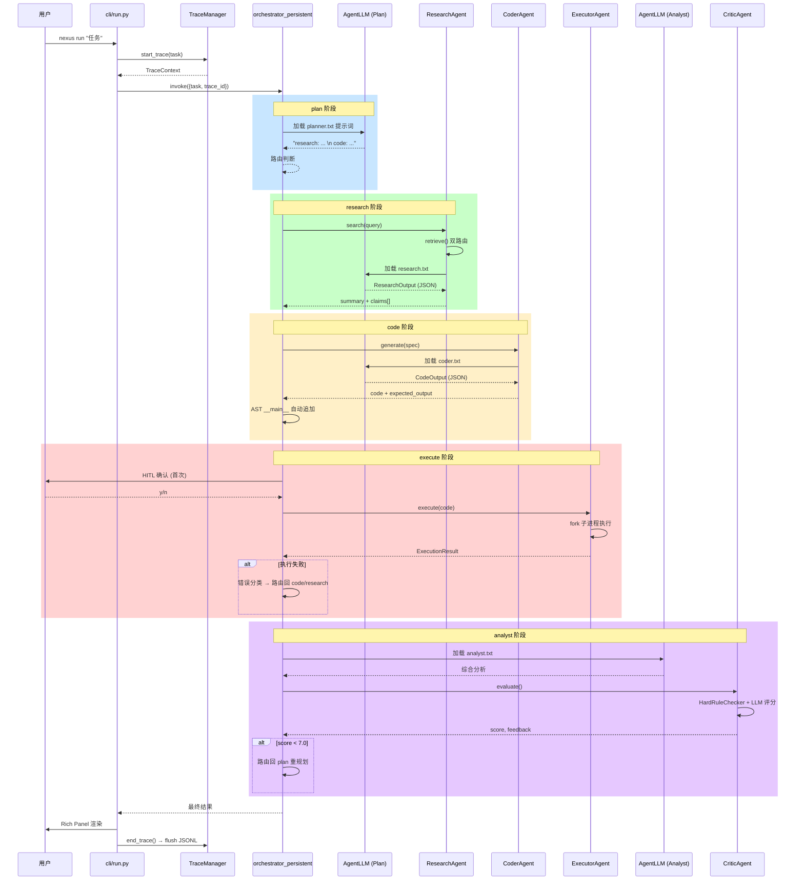

### 3.3 LangGraph 状态机核心实现

**状态定义** (`multi_agent/state.py`):

```python
class AgentState(TypedDict):
    task: str                            # 原始任务
    trace_id: str                        # Trace ID
    plan: list[str]                      # Planner 输出的步骤列表
    research_result: str                 # 检索摘要
    research_status: Literal["ok", "error", ""]
    code_result: str                     # 代码推理
    code_status: Literal["ok", "error", ""]
    analysis: str                        # 最终答案
    critique_score: float                # Critic 评分 0-10
    critique_feedback: str
    hard_verdict: Optional[dict]         # 硬规则失败详情
    error_type: str
    retry_count: int                     # 当前重试次数
    retry_instruction: str               # 重试指引
    research_query: str
    code_spec: str
    exec_stdout: str                     # 执行标准输出
    exec_stderr: str
    exec_success: bool
    exec_exception: str
    coder_truncated: bool                # LLM 输出是否被截断
    messages: Annotated[list, operator.add]  # 追加式消息历史
    # ... 共 34 个字段
```

**状态机构建** (`multi_agent/orchestrator.py`):

```python
def build_orchestrator(checkpointer=None):
    builder = StateGraph(AgentState)

    # 5 个节点 — 每个都有 trace wrapper
    builder.add_node("plan",     _trace_wrapper(plan_node, ...))
    builder.add_node("research", _trace_wrapper(research_node, ...))
    builder.add_node("code",     _trace_wrapper(code_node, ...))
    builder.add_node("execute",  _trace_wrapper(execute_node, ...))
    builder.add_node("analyst",  _trace_wrapper(analyst_node, ...))

    # 边 + 条件路由
    builder.add_edge(START, "plan")
    builder.add_conditional_edges("plan", route_after_plan, {
        "research": "research", "code": "code", "analyst": "analyst",
    })
    builder.add_conditional_edges("research", route_after_research, {
        "code": "code", "analyst": "analyst",
    })
    builder.add_edge("code", "execute")
    builder.add_conditional_edges("execute", route_after_execute, {
        "analyst": "analyst", "code": "code", "research": "research",
    })
    builder.add_conditional_edges("analyst", route_after_analyst, {
        "plan": "plan", "__end__": END,
    })

    return builder.compile(checkpointer=checkpointer)
```

> FSM 通过 `LangGraph SQLite Checkpointer` 实现状态持久化，支持任务中断后恢复。

### 3.4 各节点详解

#### 3.4.1 plan_node — 任务规划

`planner.txt` 提示词要求 LLM 将任务分解为 `research:` / `code:` 行。

```python
def plan_node(state: AgentState) -> dict:
    prompt = PLANNER_PROMPT.format(task=safe_task + feedback, date=get_current_date())
    response = _get_planner_llm().think([{"role": "user", "content": prompt}], silent=True)

    # 解析输出: "research: 搜索 OpenAI 最新动态"
    #           "code: 生成数据分析脚本"
    plan = [line.strip() for line in response.split("\n") if ":" in line.strip()]
    return {"plan": plan, "messages": [("planner", response)]}
```

**路由逻辑** (`route_after_plan`):
- 计划中包含 `research` → 进入 `research_node`
- 计划中包含 `code` → 进入 `code_node`
- 都不包含 → 直接进 `analyst_node`

#### 3.4.2 research_node — 双路由检索

```python
def research_node(state: AgentState) -> dict:
    result = _research.search(query)   # → ResearchAgent.search()
    return {
        "research_result": result.summary,
        "research_status": "ok",
        "research_claims": [c.model_dump() for c in result.claims],
    }
```

**ResearchAgent.search() 核心流程**:

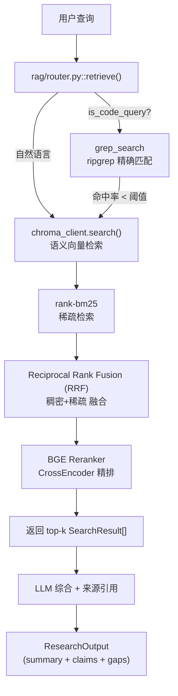

**双路由判断逻辑** (`rag/router.py`):

```python
def is_code_query(query: str) -> bool:
    """检测查询是否为代码/配置相关"""
    code_keywords = {"def ", "class ", "import ", "config", "yaml", "yml",
                     "dockerfile", "makefile", "function", "模块", "函数",
                     "代码", "配置", "参数", "接口", "API", "报错", "异常"}
    return any(kw in query.lower() for kw in code_keywords)
```

#### 3.4.3 code_node — 代码生成 + 校验

```python
def code_node(state: AgentState) -> dict:
    spec = _extract_code_spec(state)
    # 注入 research 结果作为上下文
    if research_text:
        spec = f"{spec}\n\n[研究结果供参考]:\n{research_text[:1500]}"

    output = _coder.generate(spec)  # → CoderAgent.generate()

    # ⚠ 关键: 自动追加 __main__ 块
    if output.code:
        output.code = _ensure_main_block(output.code)

    # 首次 HITL 确认，重试自动跳过
    if retry_count == 0:
        resp = input("即将执行代码，是否继续？(y/n)").strip()
        if resp != 'y':
            return {"code_status": "cancelled"}

    return {"code_result": output.reasoning, "code_status": "ok",
            "messages": [("coder", output.code)]}
```

**CoderAgent.generate() 解析流程**:

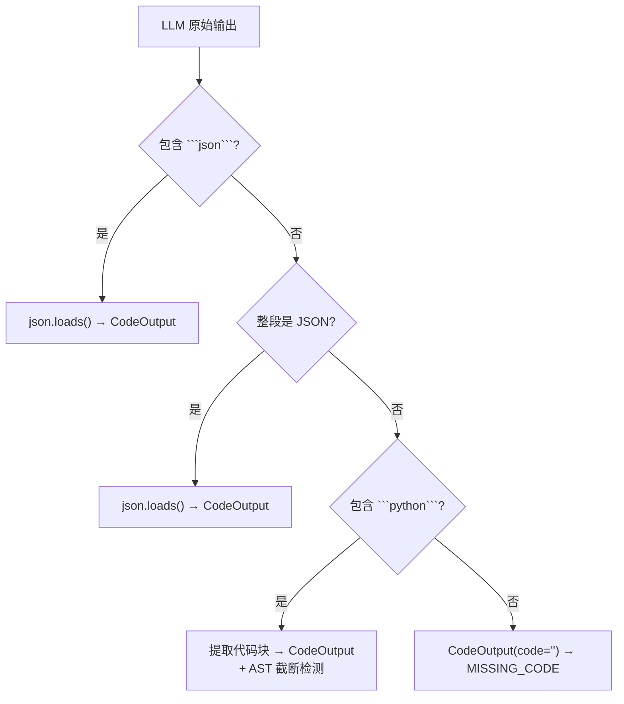

**`__main__` 自动追加** (`_ensure_main_block`):

```python
def _ensure_main_block(code: str) -> str:
    if re.search(r'^if\s+__name__\s*==\s*["\']__main__["\']', code, re.MULTILINE):
        return code  # 已有，不改

    # AST 解析 + 追加顶层函数调用
    tree = ast.parse(code)
    funcs = [node.name for node in ast.walk(tree)
             if isinstance(node, ast.FunctionDef) and not node.name.startswith('_')]
    if funcs:
        main_block = '\n\nif __name__ == "__main__":\n'
        for name in funcs[:10]:
            main_block += f'    print(f"\\n=== {name} ====")\n'
            main_block += f'    {name}()\n'
        return code + main_block
```

#### 3.4.4 execute_node — 隔离执行

```python
def execute_node(state: AgentState) -> dict:
    code = _extract_code_from_messages(state)
    result = _executor_agent.execute(code)   # 30s 超时子进程执行
    validated = _executor_agent.validate(result)

    return {
        "exec_success": result.success,
        "exec_stdout": result.stdout,
        "exec_stderr": result.stderr,
        "exec_exception": result.exception,
        "retry_count": state["retry_count"] + (0 if result.success else 1),
    }
```

**ExecutorAgent 执行流程**:

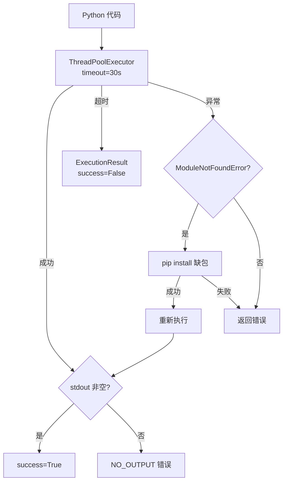

**错误分类逻辑** (`_classify_exception`):

```python
def _classify_exception(exception: str) -> ErrorType:
    if "NO_OUTPUT" in exception:
        return ErrorType.NO_OUTPUT
    if "ModuleNotFoundError" in exception or "ImportError" in exception:
        return ErrorType.TOOL_FAILURE
    if "SyntaxError" in exception:
        return ErrorType.RUNTIME_ERROR
    return ErrorType.RUNTIME_ERROR
```

#### 3.4.5 execute → 重试路由

```python
def route_after_execute(state: AgentState) -> str:
    if state.get("exec_success", False):
        return "analyst"     # 成功 → 最终分析

    if retry_count > MAX_RETRIES:       # 上限 3
        return "analyst"     # 耗尽 → 强制分析

    exc = state.get("exec_exception", "")
    if "ModuleNotFoundError" in exc or (retry_count >= 2 and "NO_OUTPUT" in exc):
        return "research"    # 缺库 → 研究新 API

    return "code"            # 默认 → 修复重试
```

#### 3.4.6 analyst_node — 综合分析 + Critic

```python
def analyst_node(state: AgentState) -> dict:
    # 1. 构建执行报告（确定性，不由 LLM 生成）
    if exec_success:
        exec_report = "**状态**: ✅ 执行成功\n**输出**:\n```\n{stdout}\n```"
    else:
        exec_report = "**状态**: ❌ 执行失败\n**错误**: {exception}"

    # 2. LLM 综合分析
    prompt = ANALYST_PROMPT.format(task=task, research=research, ..., exec_report=exec_report)
    analysis = _get_analyst_llm().think([{"role": "user", "content": prompt}])

    # 3. 正则修正 — 防止 LLM 篡改执行状态
    if exec_success:
        analysis = re.sub(r'\*\*状态\*\*[：:]\s*❌.*', '**状态**: ✅ 执行成功', analysis)

    # 4. Critic 评分
    critic_score, critic_feedback, hard_fail = _critic.evaluate(...)

    if critic_score < 7.0:
        retry_instruction = f"Critic 评分 {critic_score}/10 低于阈值 7.0。请改进。"
        next_retry_count += 1

    return {"analysis": analysis, "critique_score": critic_score, ...}
```

**CriticAgent 两阶段评估**:

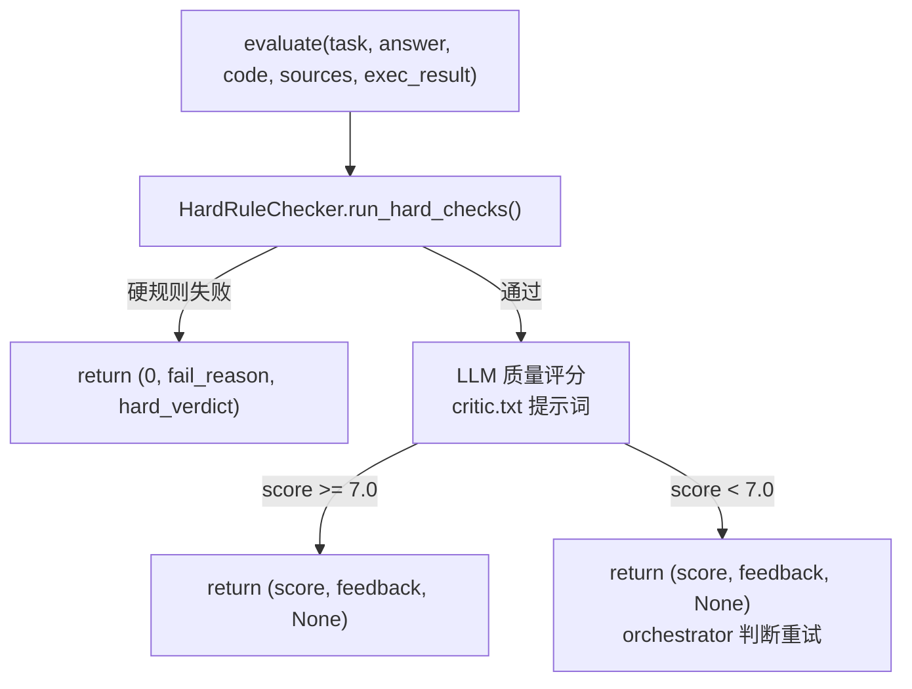

---

## 四、`nexus chat` — 交互式 ReAct 对话

### 4.1 概述

`nexus chat` 进入交互式 ReAct (Reasoning + Acting) 单 Agent 循环。支持两种工具：`web_search` 和 `python_execute`。

### 4.2 执行链路

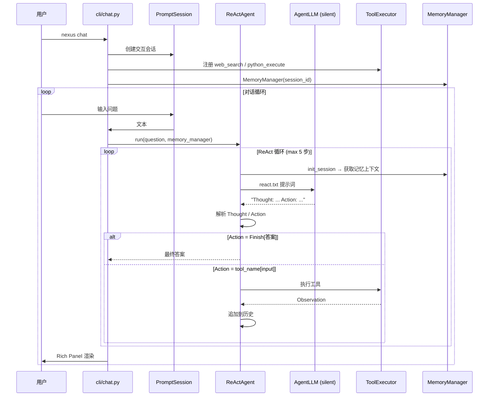

### 4.3 核心代码

**ReAct 循环** (`re_act_agent.py`):

```python
class ReActAgent:
    def run(self, question: str, memory_manager=None):
        while current_step < self.max_steps:    # 默认 5 步
            # 1. 构建提示词 (含工具描述 + 历史 + 记忆)
            prompt = REACT_PROMPT_TEMPLATE.format(
                tools=tools_desc,
                question=question,
                history=history_str,
                memory_context=memory_context,
            )

            # 2. LLM 思考
            response_text = self.llm_client.think(messages=[...])

            # 3. 解析输出: Thought + Action
            thought, action = self._parse_output(response_text)

            # 4. 执行 Action
            if action.startswith("Finish"):
                return self._parse_finish(action)  # 返回答案

            tool_name, tool_input = self._parse_action(action)
            observation = tool_function(tool_input)

            # 5. HITL: 代码执行需要确认
            if tool_name in ("python_execute",):
                if not self._ask_confirm(tool_input):
                    observation = "用户取消了代码执行"

            # 6. 追加到历史
            self.history.append(f"Action: {action}")
            self.history.append(f"Observation: {observation}")
```

**工具注册**:

```python
executor = ToolExecutor()
executor.registerTool("web_search",
    "搜索互联网获取实时信息，参数为搜索关键词",
    web_search)
executor.registerTool("python_execute",
    "在安全沙箱中执行Python代码，参数为代码字符串",
    python_execute)
```

---

## 五、`nexus init` / `nexus config` — 配置管理

### 5.1 `nexus init` — 首次初始化

交互式引导，写入 `~/.agentnexus/config.yaml`:

```python
@app.command()
def init():
    api_key = input("LLM API Key (必填): ").strip()
    model = input("LLM 模型 [deepseek/deepseek-v4-flash]: ").strip()
    base_url = input("LLM Base URL [https://api.deepseek.com]: ").strip()

    data = {"llm_api_key": api_key, "llm_model_id": model, "llm_base_url": base_url}
    yaml.dump(data, open(config_path, "w"), allow_unicode=True)
```

### 5.2 `nexus config` — 查看/修改配置

```bash
# 查看所有配置 (含来源: env / config.yaml / default)
nexus config

# 修改单个配置项
nexus config --set llm_model_id --value deepseek/deepseek-chat
```

**查看输出示例**:
```
┌───────────────────────┬──────────────────────────┬──────────────┐
│ Key                    │ Value                     │ Source       │
├───────────────────────┼──────────────────────────┼──────────────┤
│ llm_api_key           │ sk-****Ab12                │ config.yaml  │
│ llm_model_id          │ deepseek/deepseek-v4-flash │ default      │
│ llm_base_url          │ https://api.deepseek.com   │ default      │
│ llm_timeout           │ 60                        │ default      │
│ ...                   │ ...                       │ ...          │
└───────────────────────┴──────────────────────────┴──────────────┘
```

---

## 六、`nexus kb` — 知识库管理

### 6.1 `nexus kb add <path>` — 添加文档

完整的文档摄取链路:

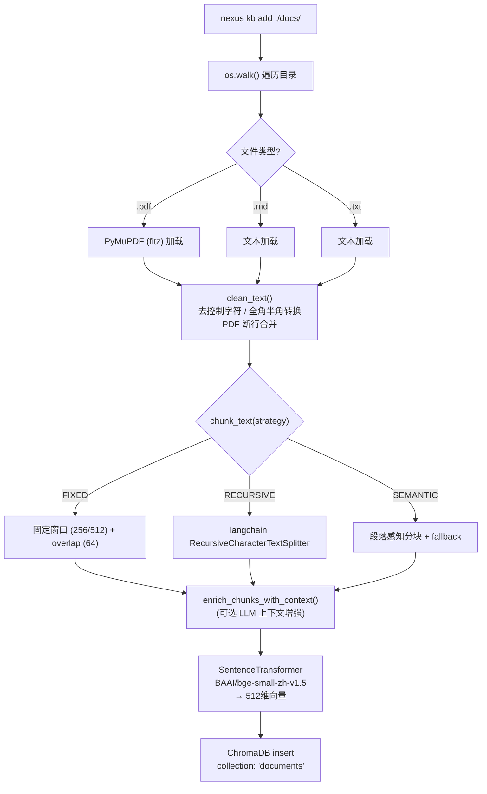

**核心代码**:

```python
@kb_app.command("add")
def kb_add(path: str):
    def _ingest_one(filepath):
        return ingest(filepath,
                      chunk_size=512,
                      enable_contextual=settings.enable_contextual_retrieval,
                      llm_client=llm_client)

    if os.path.isdir(path):
        for root, _, files in os.walk(path):
            for f in files:
                if f.endswith((".pdf", ".md", ".txt")):
                    chunks = _ingest_one(os.path.join(root, f))
                    insert_documents(chunks)
```

### 6.2 `nexus kb list` — 查看状态

```python
@kb_app.command("list")
def kb_list():
    console.print(f"知识库: [bold]{get_collection().count()}[/bold] 个文档块")
```

---

## 七、`nexus memory` — 记忆管理

### 7.1 两级记忆架构

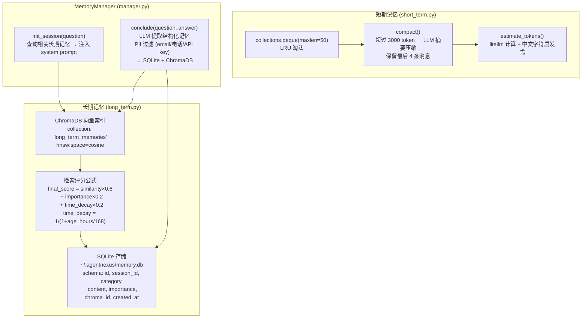

### 7.2 `nexus memory list` — 查看长期记忆

```python
@memory_app.command("list")
def memory_list(limit: int = 10):
    ltm = LongTermMemory()
    rows = ltm.list_recent(limit)
    # 输出: ID | 类别 | 重要性 | 内容 (截断 60 字符)
```

### 7.3 `nexus memory clear` — 清空记忆

```python
@memory_app.command("clear")
def memory_clear():
    ltm = LongTermMemory()
    for m in ltm.list_recent(1000):
        ltm.delete(m["id"])
```

---

## 八、`nexus logs` — Trace 可观测性

### 8.1 全链路追踪架构

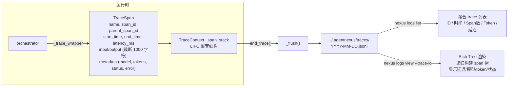

### 8.2 `nexus logs list` — 历史 Trace 列表

```bash
nexus logs list           # 最近 7 天
nexus logs list --days 30 # 最近 30 天
```

**输出示例**:
```
┌──────────┬──────────────┬─────────┬────────┬──────────┬──────┐
│ Trace ID │ 时间          │ Span 数 │ Token  │ 延迟(ms) │ 状态 │
├──────────┼──────────────┼─────────┼────────┼──────────┼──────┤
│ a1b2c3d4 │ 05-04 14:32  │       8 │  12500 │     4523 │   ✓  │
│ e5f6g7h8 │ 05-04 10:15  │       5 │   8200 │     2100 │   ✓  │
│ i9j0k1l2 │ 05-03 18:45  │      12 │  31000 │    12340 │   ✗  │
└──────────┴──────────────┴─────────┴────────┴──────────┴──────┘
```

### 8.3 `nexus logs view --trace-id <id>` — Span 树可视化

```bash
nexus logs view --trace-id a1b2c3d4
```

**输出示例**:
```
Trace 详情 a1b2c3d4
├── task (320ms) ●
│   ├── plan_node (1200ms, 450+230 tok) ●
│   ├── research_node (800ms, 200+180 tok) ●
│   ├── code_node (1500ms, 380+600 tok) ●
│   ├── execute_node (200ms) ●
│   └── analyst_node (2100ms, 1200+800 tok) ●

汇总
  Span 总数: 6
  总延迟: 6120ms
  总 Token: 输入 2670 / 输出 1870
```

---

## 九、`nexus eval` — RAG 评估

### 9.1 评估体系

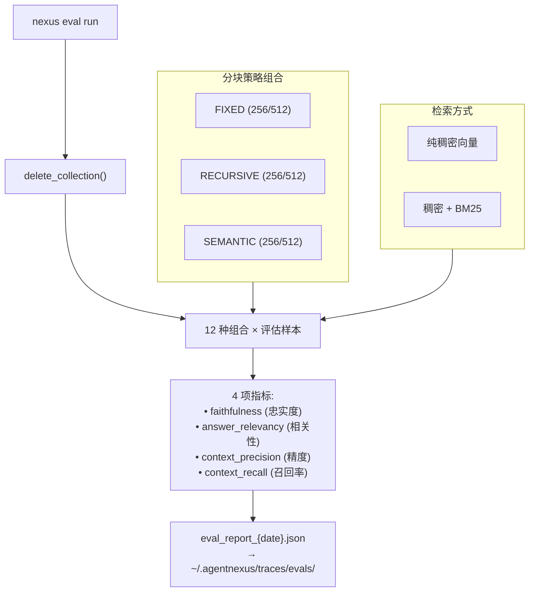

**核心代码**:

```python
combinations = [
    (ChunkStrategy.FIXED,     256, 64, False),   # 纯稠密
    (ChunkStrategy.FIXED,     256, 64, True),    # 混合检索
    (ChunkStrategy.RECURSIVE, 256, 64, False),
    # ... 共 12 种组合
]
for strategy, chunk_size, overlap, use_hybrid in combinations:
    run = evaluator.run_combination(strategy, chunk_size, overlap, use_hybrid)
```

---

## 十、`nexus stats` — Token 成本统计

### 10.1 统计流程

```bash
nexus stats           # 最近 7 天
nexus stats --days 30 # 最近 30 天
```

从 JSONL trace 文件中汇总:
- **总任务数** + **平均重试次数**
- **输入/输出 Token** (总量)
- **成本估算** (CNY，基于模型定价表)
- **延迟**: 平均 / P95 / 最大
- **按模型分布**: 每个模型的任务数、Token 量、成本占比
- **按日期趋势**: 每日任务数、Token 使用趋势

---

## 十一、内部系统详解

### 11.1 LLM 调用 (core/llm.py)

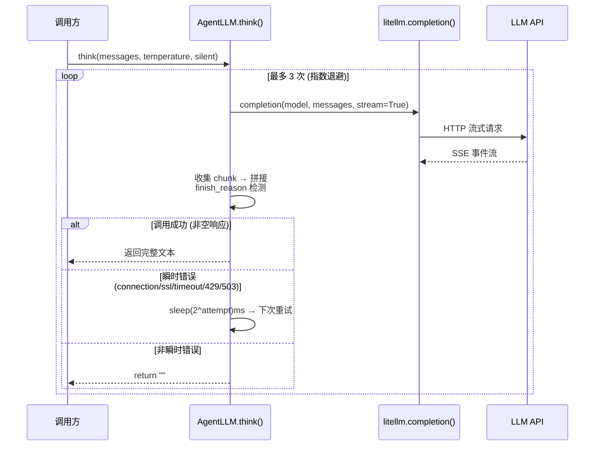

**关键细节**:
- 流式调用 + Rich Live 渲染 (非 silent 模式)
- Token 计数: 优先取 API 返回的 usage，fallback 到 litellm.token_counter
- model ID 自动推断 provider 前缀: `deepseek.com` → `deepseek/<model>`, `openai.com` → `openai/<model>`

### 11.2 ErrorType 完整定义 (agents/schema.py)

```python
class ErrorType(str, Enum):
    MISSING_CODE = "missing_code"       # LLM 未生成代码
    RUNTIME_ERROR = "runtime_error"     # 运行时报错
    HALLUCINATION = "hallucination"     # 编造数据
    TOOL_FAILURE = "tool_failure"       # 工具调用失败
    SCHEMA_VIOLATION = "schema_violation" # 输出格式不符
    NO_OUTPUT = "no_output"             # 执行无输出
    EMPTY_RESULT = "empty_result"       # 结果为空
    LOGIC_ERROR = "logic_error"         # 逻辑错误
    TRUNCATION = "truncation"           # 输出被截断
```

**重试策略映射**:

| ErrorType | 策略 | 最大重试 | 典型场景 |
|-----------|------|---------|---------|
| MISSING_CODE | force_code_only | 2 | LLM 返回空或非代码内容 |
| RUNTIME_ERROR | feed_error_back | 3 | SyntaxError, NameError 等 |
| HALLUCINATION | force_retrieval | 2 | 检测到编造的数据 |
| TOOL_FAILURE | fallback | 1 | API 调用失败 |
| SCHEMA_VIOLATION | retry_with_schema | 2 | JSON 格式不符合 Pydantic Schema |
| NO_OUTPUT | force_execution | 2 | 代码运行但无任何输出 |
| EMPTY_RESULT | force_execution | 2 | 输出为空字符串 |
| LOGIC_ERROR | fix_logic | 3 | 输出与预期不符 |
| TRUNCATION | simplify | 2 | 输出被截断 (需压缩到 800 字符) |

### 11.3 Pydantic Schema 模型

```
SourceClaim
├── claim: str           ─ 具体事实声明
├── source: str          ─ 来源 (URL / 文件路径 / 工具名)
└── confidence: float    ─ 置信度 0-1

ResearchOutput
├── summary: str         ─ 检索综合摘要
├── claims: list[SourceClaim]  ─ 每条声明带来源
└── gaps: str            ─ 信息缺口说明

CodeOutput
├── reasoning: str       ─ 代码设计思路
├── code: str            ─ 完整可执行 Python 代码
└── expected_output: str ─ 预期输出描述

ExecutionResult
├── success: bool        ─ 是否成功运行
├── stdout: str          ─ 标准输出
├── stderr: str          ─ 标准错误
├── exception: str       ─ 异常信息
└── exit_code: int       ─ 退出码

CriticVerdict
├── passed: bool         ─ 是否通过
├── score: float         ─ 0-10 评分
├── feedback: str        ─ 改进建议
└── fail_reason: str     ─ 硬规则失败原因

OutputDiff
├── matched: bool        ─ 输出是否匹配预期
├── expected: str        ─ 预期输出
├── actual: str          ─ 实际输出
└── detail: str          ─ 详细差异说明
```

### 11.4 提示词系统

| 提示词文件 | 用途 | 使用位置 |
|-----------|------|---------|
| `planner.txt` | 任务分解 → `research:` / `code:` 行 | plan_node |
| `research.txt` | RAG + Web 检索综合，来源强制引用 | ResearchAgent |
| `coder.txt` | 代码生成，JSON 输出格式，`__main__` 强制 | CoderAgent |
| `analyst.txt` | 综合分析，确定性执行报告 | analyst_node |
| `critic.txt` | 质量评分 (completeness/compliance/sources/correctness/practicality) | CriticAgent |
| `react.txt` | ReAct 循环: Thought→Action→Observation | ReActAgent (chat 模式) |
| `contextual.txt` | Chunk 上下文定位 (1-2 句描述) | RAG ingestion |
| `memory_extract.txt` | 从对话中提取结构化记忆 | MemoryManager |
| `memory_summarize.txt` | 会话摘要压缩 | MemoryManager |
| `eval_faithfulness.txt` | RAGAS 忠实度评估 | evaluator |
| `eval_relevancy.txt` | RAGAS 相关性评估 | evaluator |
| `eval_generate.txt` | 评估数据生成 | evaluator |

所有提示词使用 `str.format()` 注入变量 (非 Jinja2)，通过 `load_prompt(name)` 加载。

---

## 十二、完整命令参考

| 命令 | 描述 | 核心文件 |
|------|------|---------|
| `nexus run <task>` | 多 Agent LangGraph FSM 编排执行 | `cli/run.py` |
| `nexus chat` | 交互式 ReAct 对话 (web_search + python_execute) | `cli/chat.py` |
| `nexus init` | 首次初始化配置向导 | `cli/config.py` |
| `nexus config` | 查看所有配置 (含来源) | `cli/config.py` |
| `nexus config --set K --value V` | 修改单个配置项 | `cli/config.py` |
| `nexus kb add <path>` | 添加 PDF/MD/TXT 到知识库 | `cli/kb.py` |
| `nexus kb list` | 查看知识库文档块数量 | `cli/kb.py` |
| `nexus memory list [--limit N]` | 查看长期记忆 | `cli/memory_cmd.py` |
| `nexus memory clear` | 清空长期记忆 | `cli/memory_cmd.py` |
| `nexus logs list [--days N]` | 列出历史 Trace 记录 | `cli/logs.py` |
| `nexus logs view --trace-id <id>` | 查看 Span 树 | `cli/logs.py` |
| `nexus eval list` | 列出评估数据集 | `cli/eval_cmd.py` |
| `nexus eval run` | 运行 RAG 评估 (12 种策略组合) | `cli/eval_cmd.py` |
| `nexus stats [--days N]` | Token 成本统计 | `cli/stats.py` |
| `nexus version` | 显示版本号 | `cli/run.py` |

---

## 十三、数据目录结构

```
~/.agentnexus/
├── config.yaml         ← 配置文件 (API Key, 模型等)
├── chroma/             ← ChromaDB PersistentClient 数据
│   ├── documents/      ← RAG 知识库集合
│   └── long_term_memories/ ← 记忆向量索引
├── memory.db           ← 长期记忆 SQLite
├── traces/             ← JSONL Trace 文件
│   ├── 2025-05-04.jsonl
│   └── evals/          ← 评估报告
└── checkpoints/        ← LangGraph 状态持久化
    └── checkpoints.db
```
