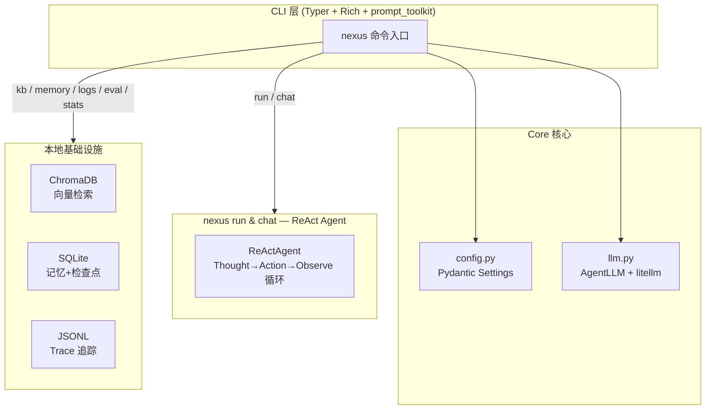
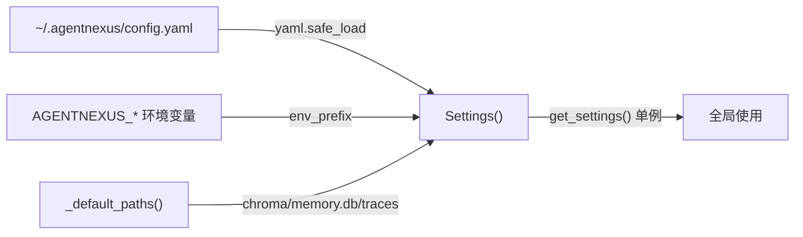
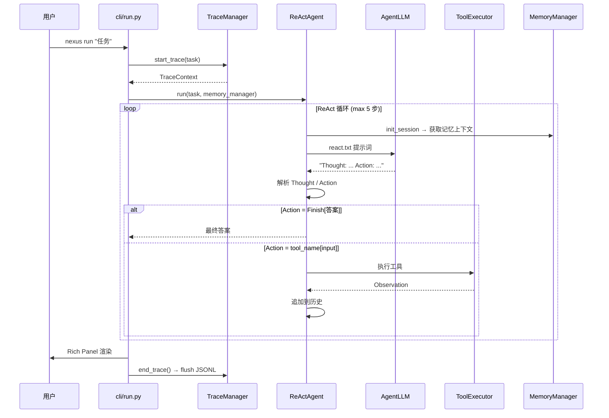
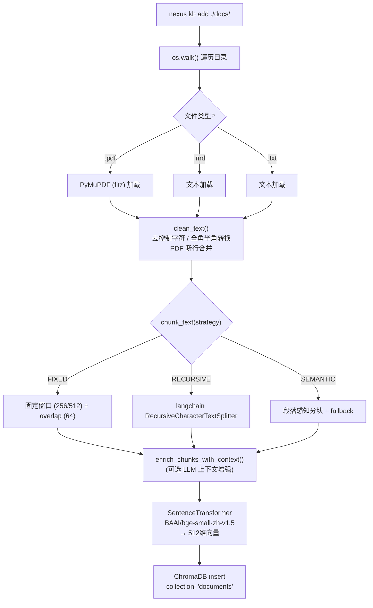
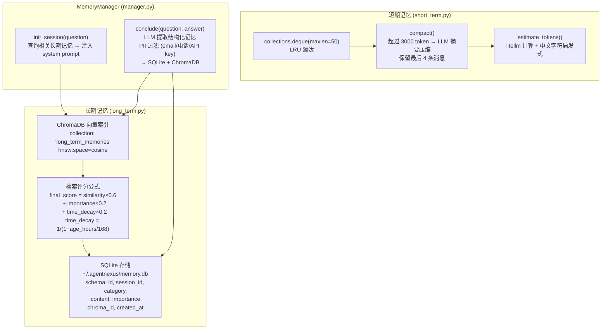
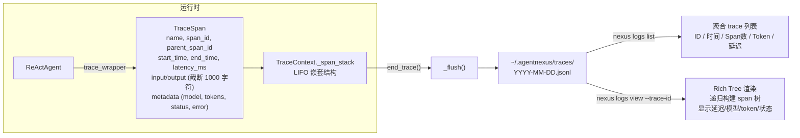
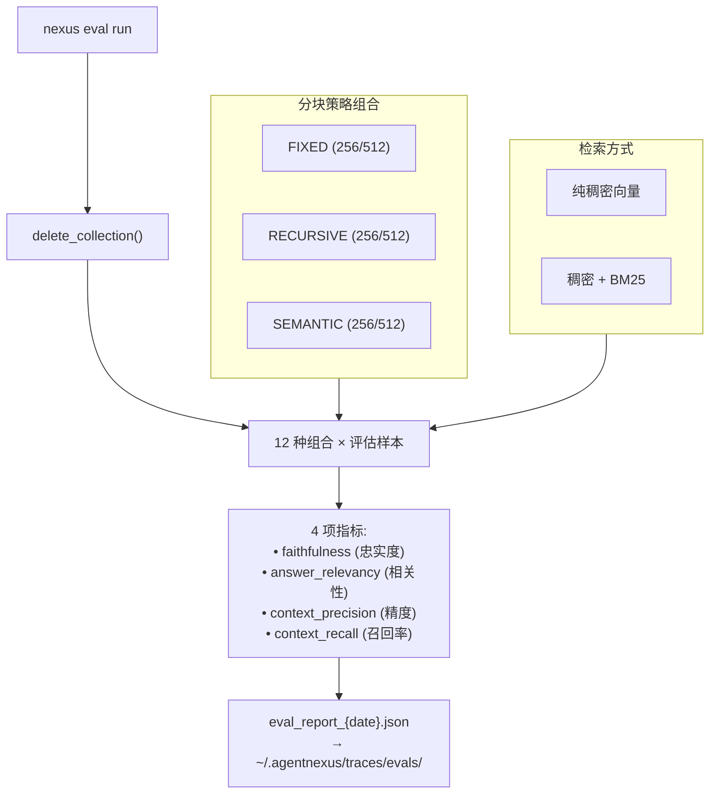
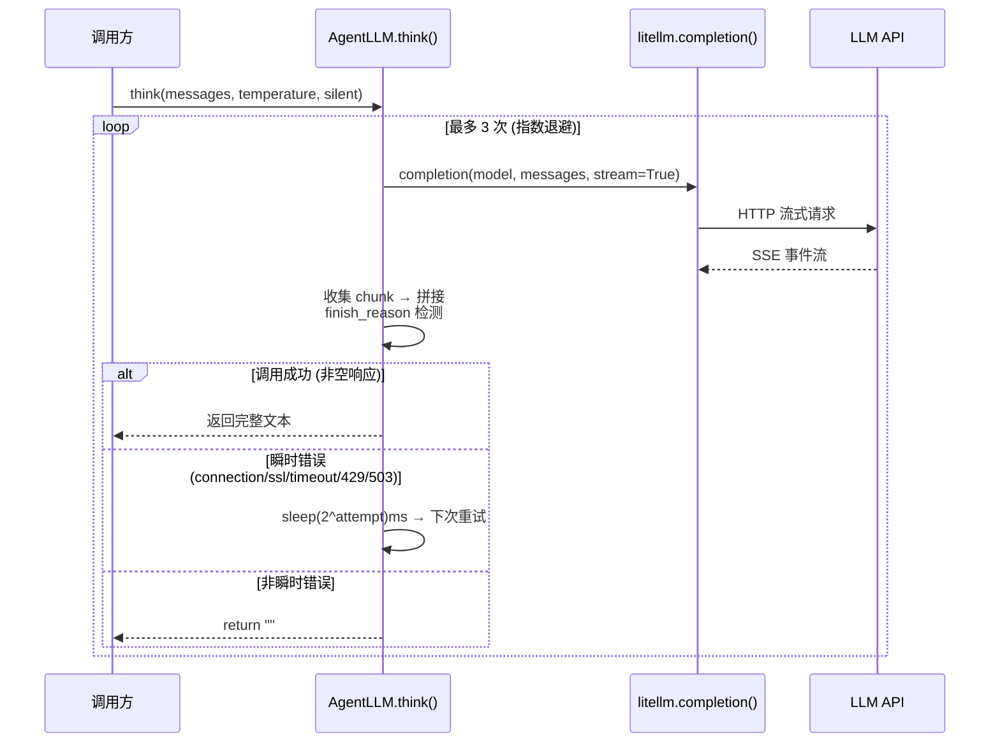

# AgentNexus API 文档

> 企业级单智能体任务协同 CLI — 每一条命令的实现原理、执行链路与核心代码。

---

## 一、系统架构总览



## 二、CLI 入口与初始化

### 2.1 入口点链

```
终端执行 nexus <command>
       │
       ▼
pyproject.toml  [project.scripts]
  nexus = "agentnexus.cli:app"
       │
       ▼
agentnexus/cli/__init__.py
  app = typer.Typer(name="nexus")
  kb_app / memory_app / logs_app / eval_app ← 子命令组
       │
       ▼
agentnexus/__main__.py (python -m 模式 / PyInstaller)
  from agentnexus.cli import app
  app()
```

**核心代码** (`cli/__init__.py`):

```python
app = typer.Typer(name="nexus", help="AgentNexus - 单智能体任务协同 CLI")
console = Console()

# 四个子命令组
kb_app = typer.Typer(help="知识库管理")      # → nexus kb ...
memory_app = typer.Typer(help="记忆管理")      # → nexus memory ...
logs_app = typer.Typer(help="历史 Trace 查看") # → nexus logs ...
eval_app = typer.Typer(help="RAG 评估")        # → nexus eval ...

# 延迟导入，避免启动时加载所有模块
from agentnexus.cli import run, chat, kb, memory_cmd, logs, eval_cmd, stats, config
```

### 2.2 配置加载链路



**优先级**: YAML 文件 > 环境变量 (`AGENTNEXUS_*`) > Pydantic 默认值。

```python
class Settings(BaseSettings):
    model_config = SettingsConfigDict(env_prefix="AGENTNEXUS_", extra="ignore")

    llm_api_key: SecretStr = Field(default=SecretStr(""))
    llm_model_id: str = Field(default="deepseek/deepseek-v4-flash")
    llm_base_url: str = Field(default="https://api.deepseek.com")
    llm_timeout: int = Field(default=60, ge=1)
    # ... 11 个配置项
```

---

## 三、`nexus run` — ReAct 单 Agent 执行

### 3.1 概述

`nexus run "<任务描述>"` 是系统核心命令，启动 ReActAgent (Thought→Action→Observe) 循环执行任务。

**调用方式**: `nexus run "搜索 AI 趋势并写分析报告"`

### 3.2 完整执行链路



### 3.3 ReActAgent 核心实现

**ReAct 循环** (`re_act_agent.py`):

```python
class ReActAgent:
    def run(self, question: str, memory_manager=None):
        while current_step < self.max_steps:    # 默认 5 步
            # 1. 构建提示词 (含工具描述 + 历史 + 记忆)
            prompt = REACT_PROMPT_TEMPLATE.format(
                tools=tools_desc,
                question=question,
                history=history_str,
                memory_context=memory_context,
            )

            # 2. LLM 思考
            response_text = self.llm_client.think(messages=[...])

            # 3. 解析输出: Thought + Action
            thought, action = self._parse_output(response_text)

            # 4. 执行 Action
            if action.startswith("Finish"):
                return self._parse_finish(action)  # 返回答案

            tool_name, tool_input = self._parse_action(action)
            observation = tool_function(tool_input)

            # 5. HITL: 代码执行需要确认
            if tool_name in ("python_execute",):
                if not self._ask_confirm(tool_input):
                    observation = "用户取消了代码执行"

            # 6. 追加到历史
            self.history.append(f"Action: {action}")
            self.history.append(f"Observation: {observation}")
```

### 3.4 ReActAgent 解析

**`_parse_output` — 三层解析**:

```python
def _parse_output(self, text: str):
    """Three-layer fallback: strict XML → diagnose failure → legacy text format."""
    # Layer 1: strict XML (<thought> + <action>)
    thought_match = re.search(r"<thought>\s*(.*?)\s*</thought>", text, re.DOTALL)
    action_match = re.search(r"(<action\s+[^>]*>.*?</action>)", text, re.DOTALL)

    # Layer 2: diagnose WHY XML failed (truncation? formatting?)
    # Layer 3: fallback to "Thought:" / "Action:" text format

    return (thought, action, failure_reason)
```

**工具注册** — `nexus run` 注册 4 个工具:

```python
executor.registerTool("memory_search", ...)
executor.registerTool("memory_save", ...)
executor.registerTool("web_search", ...)
executor.registerTool("python_execute", risk_level="high", require_hitl=True)
```

---

## 四、`nexus chat` — 交互式 ReAct 对话

### 4.1 概述

`nexus chat` 进入交互式 ReAct (Reasoning + Acting) 单 Agent 循环。支持工具：`web_search`、`python_execute`、`memory_save`、`memory_search`。

### 4.2 执行链路

nexus chat 执行链路与 nexus run 共享同一 ReActAgent 实现。差异点：
- 使用 PromptSession 交互循环，而非一次性任务
- 注册的工具有 web_search、python_execute、memory_save、memory_search
- 支持 Git 式对话版本控制 (`/undo`, `/redo`, `/checkout` 等)

---

## 五、`nexus init` / `nexus config` — 配置管理

### 5.1 `nexus init` — 首次初始化

交互式引导，写入 `~/.agentnexus/config.yaml`:

```python
@app.command()
def init():
    api_key = input("LLM API Key (必填): ").strip()
    model = input("LLM 模型 [deepseek/deepseek-v4-flash]: ").strip()
    base_url = input("LLM Base URL [https://api.deepseek.com]: ").strip()

    data = {"llm_api_key": api_key, "llm_model_id": model, "llm_base_url": base_url}
    yaml.dump(data, open(config_path, "w"), allow_unicode=True)
```

### 5.2 `nexus config` — 查看/修改配置

```bash
# 查看所有配置 (含来源: env / config.yaml / default)
nexus config

# 修改单个配置项
nexus config --set llm_model_id --value deepseek/deepseek-chat
```

**查看输出示例**:
```
┌───────────────────────┬──────────────────────────┬──────────────┐
│ Key                    │ Value                     │ Source       │
├───────────────────────┼──────────────────────────┼──────────────┤
│ llm_api_key           │ sk-****Ab12                │ config.yaml  │
│ llm_model_id          │ deepseek/deepseek-v4-flash │ default      │
│ llm_base_url          │ https://api.deepseek.com   │ default      │
│ llm_timeout           │ 60                        │ default      │
│ ...                   │ ...                       │ ...          │
└───────────────────────┴──────────────────────────┴──────────────┘
```

---

## 六、`nexus kb` — 知识库管理

### 6.1 `nexus kb add <path>` — 添加文档

完整的文档摄取链路:



**核心代码**:

```python
@kb_app.command("add")
def kb_add(path: str):
    def _ingest_one(filepath):
        return ingest(filepath,
                      chunk_size=512,
                      enable_contextual=settings.enable_contextual_retrieval,
                      llm_client=llm_client)

    if os.path.isdir(path):
        for root, _, files in os.walk(path):
            for f in files:
                if f.endswith((".pdf", ".md", ".txt")):
                    chunks = _ingest_one(os.path.join(root, f))
                    insert_documents(chunks)
```

### 6.2 `nexus kb list` — 查看状态

```python
@kb_app.command("list")
def kb_list():
    console.print(f"知识库: [bold]{get_collection().count()}[/bold] 个文档块")
```

---

## 七、`nexus memory` — 记忆管理

### 7.1 两级记忆架构



### 7.2 `nexus memory list` — 查看长期记忆

```python
@memory_app.command("list")
def memory_list(limit: int = 10):
    ltm = LongTermMemory()
    rows = ltm.list_recent(limit)
    # 输出: ID | 类别 | 重要性 | 内容 (截断 60 字符)
```

### 7.3 `nexus memory clear` — 清空记忆

```python
@memory_app.command("clear")
def memory_clear():
    ltm = LongTermMemory()
    for m in ltm.list_recent(1000):
        ltm.delete(m["id"])
```

---

## 八、`nexus logs` — Trace 可观测性

### 8.1 全链路追踪架构



### 8.2 `nexus logs list` — 历史 Trace 列表

```bash
nexus logs list           # 最近 7 天
nexus logs list --days 30 # 最近 30 天
```

**输出示例**:
```
┌──────────┬──────────────┬─────────┬────────┬──────────┬──────┐
│ Trace ID │ 时间          │ Span 数 │ Token  │ 延迟(ms) │ 状态 │
├──────────┼──────────────┼─────────┼────────┼──────────┼──────┤
│ a1b2c3d4 │ 05-04 14:32  │       8 │  12500 │     4523 │   ✓  │
│ e5f6g7h8 │ 05-04 10:15  │       5 │   8200 │     2100 │   ✓  │
│ i9j0k1l2 │ 05-03 18:45  │      12 │  31000 │    12340 │   ✗  │
└──────────┴──────────────┴─────────┴────────┴──────────┴──────┘
```

### 8.3 `nexus logs view --trace-id <id>` — Span 树可视化

```bash
nexus logs view --trace-id a1b2c3d4
```

**输出示例**:
```
Trace 详情 a1b2c3d4
├── task (320ms) ●
│   ├── plan_node (1200ms, 450+230 tok) ●
│   ├── research_node (800ms, 200+180 tok) ●
│   ├── code_node (1500ms, 380+600 tok) ●
│   ├── execute_node (200ms) ●
│   └── analyst_node (2100ms, 1200+800 tok) ●

汇总
  Span 总数: 6
  总延迟: 6120ms
  总 Token: 输入 2670 / 输出 1870
```

---

## 九、`nexus eval` — RAG 评估

### 9.1 评估体系



**核心代码**:

```python
combinations = [
    (ChunkStrategy.FIXED,     256, 64, False),   # 纯稠密
    (ChunkStrategy.FIXED,     256, 64, True),    # 混合检索
    (ChunkStrategy.RECURSIVE, 256, 64, False),
    # ... 共 12 种组合
]
for strategy, chunk_size, overlap, use_hybrid in combinations:
    run = evaluator.run_combination(strategy, chunk_size, overlap, use_hybrid)
```

---

## 十、`nexus stats` — Token 成本统计

### 10.1 统计流程

```bash
nexus stats           # 最近 7 天
nexus stats --days 30 # 最近 30 天
```

从 JSONL trace 文件中汇总:
- **总任务数** + **平均重试次数**
- **输入/输出 Token** (总量)
- **成本估算** (CNY，基于模型定价表)
- **延迟**: 平均 / P95 / 最大
- **按模型分布**: 每个模型的任务数、Token 量、成本占比
- **按日期趋势**: 每日任务数、Token 使用趋势

---

## 十一、内部系统详解

### 11.1 LLM 调用 (core/llm.py)



**关键细节**:
- 流式调用 + Rich Live 渲染 (非 silent 模式)
- Token 计数: 优先取 API 返回的 usage，fallback 到 litellm.token_counter
- model ID 自动推断 provider 前缀: `deepseek.com` → `deepseek/<model>`, `openai.com` → `openai/<model>`

### 11.2 提示词系统

| 提示词文件 | 用途 | 使用位置 |
|-----------|------|---------|
| `react.txt` | ReAct 循环: Thought→Action→Observation | ReActAgent |
| `contextual.txt` | Chunk 上下文定位 (1-2 句描述) | RAG ingestion |
| `memory_extract.txt` | 从对话中提取结构化记忆 | MemoryManager |
| `memory_summarize.txt` | 会话摘要压缩 | MemoryManager |
| `eval_faithfulness.txt` | RAGAS 忠实度评估 | evaluator |
| `eval_relevancy.txt` | RAGAS 相关性评估 | evaluator |
| `eval_generate.txt` | 评估数据生成 | evaluator |

所有提示词使用 `str.format()` 注入变量 (非 Jinja2)，通过 `load_prompt(name)` 加载。

---

## 十二、完整命令参考

| 命令 | 描述 | 核心文件 |
|------|------|---------|
| `nexus run <task>` | ReAct 单 Agent 执行 | `cli/run.py` |
| `nexus chat` | 交互式 ReAct 对话 (web_search + python_execute) | `cli/chat.py` |
| `nexus init` | 首次初始化配置向导 | `cli/config.py` |
| `nexus config` | 查看所有配置 (含来源) | `cli/config.py` |
| `nexus config --set K --value V` | 修改单个配置项 | `cli/config.py` |
| `nexus kb add <path>` | 添加 PDF/MD/TXT 到知识库 | `cli/kb.py` |
| `nexus kb list` | 查看知识库文档块数量 | `cli/kb.py` |
| `nexus memory list [--limit N]` | 查看长期记忆 | `cli/memory_cmd.py` |
| `nexus memory clear` | 清空长期记忆 | `cli/memory_cmd.py` |
| `nexus logs list [--days N]` | 列出历史 Trace 记录 | `cli/logs.py` |
| `nexus logs view --trace-id <id>` | 查看 Span 树 | `cli/logs.py` |
| `nexus eval list` | 列出评估数据集 | `cli/eval_cmd.py` |
| `nexus eval run` | 运行 RAG 评估 (12 种策略组合) | `cli/eval_cmd.py` |
| `nexus stats [--days N]` | Token 成本统计 | `cli/stats.py` |
| `nexus version` | 显示版本号 | `cli/run.py` |

---

## 十三、数据目录结构

```
~/.agentnexus/
├── config.yaml         ← 配置文件 (API Key, 模型等)
├── chroma/             ← ChromaDB PersistentClient 数据
│   ├── documents/      ← RAG 知识库集合
│   └── long_term_memories/ ← 记忆向量索引
├── memory.db           ← 长期记忆 SQLite
├── traces/             ← JSONL Trace 文件
│   ├── 2025-05-04.jsonl
│   └── evals/          ← 评估报告
└── evals/              ← 评估报告
```
