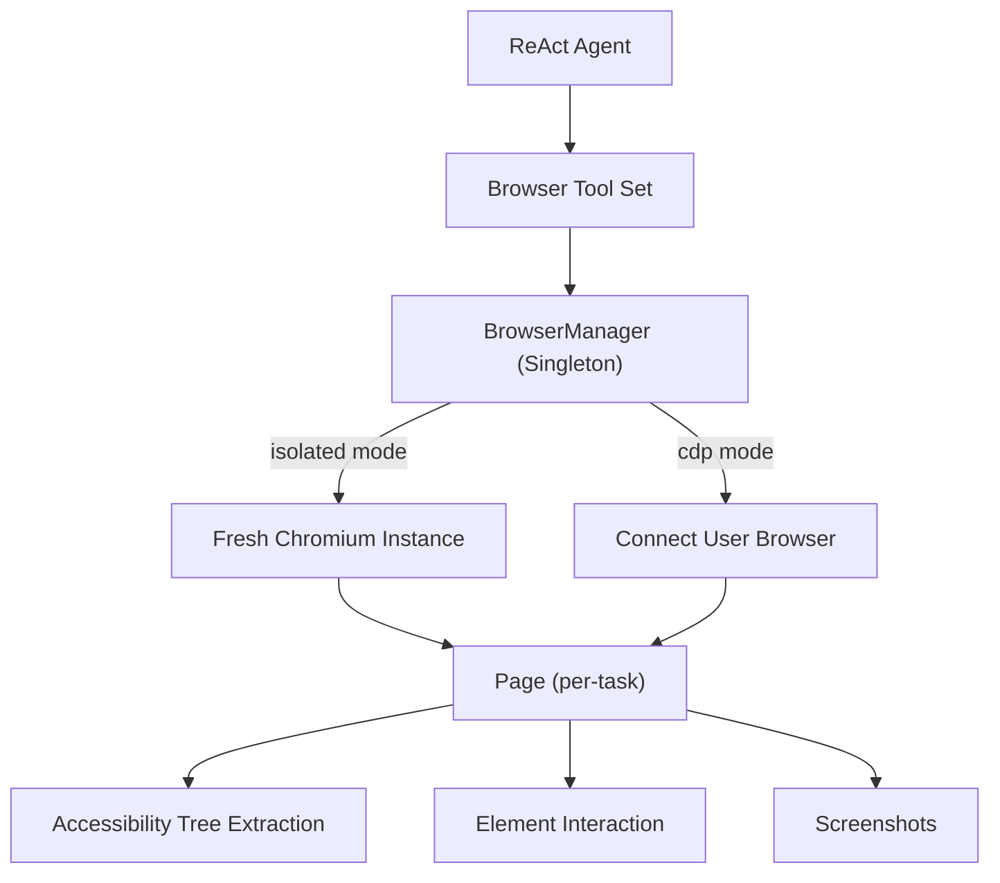
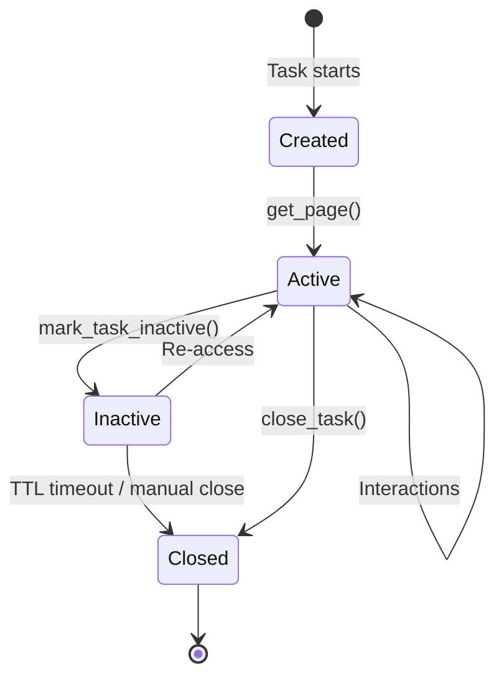

> **[中文](Browser-Automation.md) | [English](Browser-Automation.en.md)**

# 🌐 Browser Automation

AgentNexus implements browser automation through Playwright, supporting headless/headed Chromium control and accessibility tree extraction.

## Architecture Overview



## Two Operating Modes

### Isolated Mode (Default)

- Launches a fresh Chromium instance
- Each task gets its own BrowserContext
- Completely isolated, does not affect user's browser
- Suitable for automation testing and scraping

### CDP Mode

- Connects to user's running browser via Chrome DevTools Protocol
- Shares user's browser context (cookies, login state, etc.)
- Each task gets a new Page
- If connection fails, automatically launches Chrome with debugging port

```yaml
# config.yaml example
browser_mode: cdp                    # isolated or cdp
browser_cdp_endpoint: "http://localhost:9222"
browser_headless: false              # only for isolated mode
browser_viewport_width: 1280
browser_viewport_height: 720
browser_default_timeout: 30000       # operation timeout (ms)
browser_networkidle_timeout: 5000    # networkidle timeout (ms)
browser_context_ttl: 600             # idle task auto-cleanup (seconds)
browser_allow_js_execution: false    # allow JavaScript execution
browser_snapshot_max_nodes: 100      # max accessibility tree nodes
```

## Tool Set

| Tool | Function | Risk Level |
| --- | --- | --- |
| `browser_navigate` | Navigate to URL | LOW |
| `browser_snapshot` | Get accessibility tree snapshot | LOW |
| `browser_click` | Click element | MEDIUM |
| `browser_type` | Input text | MEDIUM |
| `browser_read` | Read element text | LOW |
| `browser_screenshot` | Take page screenshot | LOW |
| `browser_evaluate` | Execute JavaScript | HIGH |
| `browser_wait` | Wait for element | LOW |
| `browser_scroll` | Scroll page | LOW |
| `browser_scroll_to` | Scroll to position | LOW |

## Accessibility Tree Snapshot

The core of browser automation is **Accessibility Tree** extraction, not traditional DOM selectors.

### Snapshot Modes

| Mode | Contains | Use Case |
| --- | --- | --- |
| `interactive` | Buttons, links, inputs, etc. | Automation |
| `reading` | Interactive + headings, paragraphs, status | Content extraction |
| `full` | All semantic elements (excluding generic/none) | Full analysis |

### Output Format

```text
[1] button "Login" ref=s1e3 [visible]
[2] textbox "Search" ref=s1e4 [box=400,620,760,24] [visible]
[3] heading "Welcome" ref=s1e1 [level=1] [visible]
[4] link "About" ref=s1e5 [below viewport]
```

Each element includes:
- **Index**: Used for `click`/`type` operations
- **Role**: Accessibility role (button, textbox, heading, etc.)
- **Name**: Element's accessible name
- **ref**: Playwright internal reference
- **Position**: Bounding box and viewport status

## Element Location Strategy

BrowserManager uses priority-based location:

1. **pos parameter**: Direct coordinates `"400,620,760,24"`
2. **role + name**: e.g., `role="button", name="Login"`
3. **name only**: Search by name
4. **selector**: CSS selector (last resort)

## Task Isolation & Lifecycle



- Each task has an independent Page
- Idle tasks are auto-reclaimed via TTL (default 600 seconds)
- Background coroutine checks every 60 seconds

## Sub-agents & Browser

Sub-agents can use browser tools via `allowed_tools` configuration:

```yaml
# SKILL.md example
---
id: web-research
allow_tools: [browser_navigate, browser_snapshot, browser_click, browser_read]
---
```

## Security Considerations

1. **JavaScript Execution**: Disabled by default, must explicitly enable `browser_allow_js_execution: true`
2. **CDP Mode**: Shares user's browser context, requires trust in Agent behavior
3. **Timeout Control**: All operations have timeout limits to prevent hanging
4. **Resource Isolation**: Each task has independent Page, prevents cross-task interference
5. **Auto Cleanup**: TTL mechanism automatically reclaims idle resources

## Troubleshooting

| Problem | Cause | Solution |
| --- | --- | --- |
| `playwright not installed` | Missing dependency | `pip install playwright && playwright install chromium` |
| CDP connection failed | Chrome not started with debug port | Start Chrome with `--remote-debugging-port=9222` |
| Element not found | Page not loaded | Use `browser_wait` to wait for element |
| Timeout error | Operation too slow | Adjust `browser_default_timeout` config |

> See [Tool Governance](Tool-Governance.en.md) for security gates, [Configuration](Configuration.en.md) for all config items.
