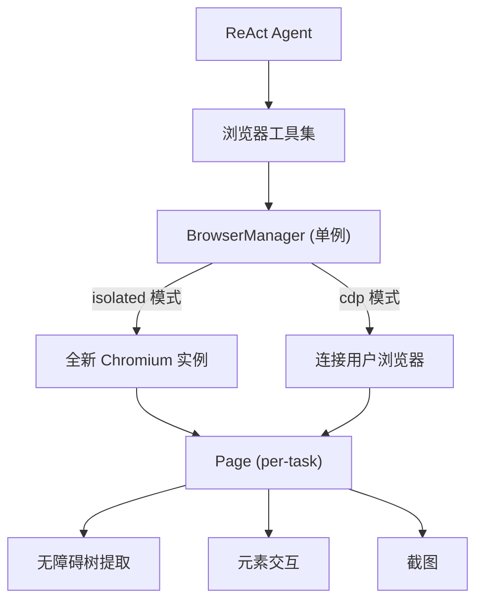
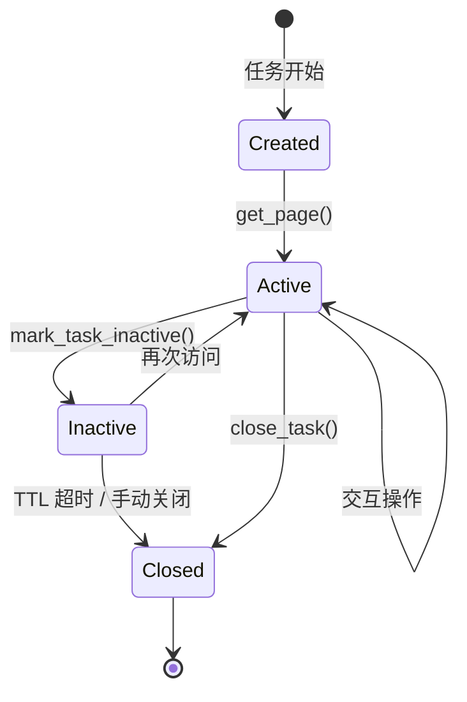

> **[中文](Browser-Automation.md) | [English](Browser-Automation.en.md)**

# 🌐 浏览器自动化

AgentNexus 通过 Playwright 实现浏览器自动化，支持无头/有头 Chromium 控制和无障碍树提取。

## 架构概览



## 两种运行模式

### Isolated 模式（默认）

- 启动全新的 Chromium 实例
- 每个任务获得独立的 BrowserContext
- 完全隔离，不影响用户浏览器
- 适合自动化测试和爬取

### CDP 模式

- 通过 Chrome DevTools Protocol 连接用户正在运行的浏览器
- 共享用户的浏览器上下文（Cookie、登录状态等）
- 每个任务获得新的 Page
- 如果连接失败，自动启动带调试端口的 Chrome

```yaml
# config.yaml 配置示例
browser_mode: cdp                    # isolated 或 cdp
browser_cdp_endpoint: "http://localhost:9222"
browser_headless: false              # 仅 isolated 模式生效
browser_viewport_width: 1280
browser_viewport_height: 720
browser_default_timeout: 30000       # 操作超时 (ms)
browser_networkidle_timeout: 5000    # networkidle 独立超时 (ms)
browser_context_ttl: 600             # 空闲任务自动回收时间 (秒)
browser_allow_js_execution: false    # 是否允许执行 JavaScript
browser_snapshot_max_nodes: 100      # 无障碍树最大节点数
```

## 工具集

| 工具 | 功能 | 风险等级 |
| --- | --- | --- |
| `browser_navigate` | 导航到 URL | LOW |
| `browser_snapshot` | 获取无障碍树快照 | LOW |
| `browser_click` | 点击元素 | MEDIUM |
| `browser_type` | 输入文本 | MEDIUM |
| `browser_read` | 读取元素文本 | LOW |
| `browser_screenshot` | 截取页面截图 | LOW |
| `browser_evaluate` | 执行 JavaScript | HIGH |
| `browser_wait` | 等待元素出现 | LOW |
| `browser_scroll` | 滚动页面 | LOW |
| `browser_scroll_to` | 滚动到指定位置 | LOW |

## 无障碍树快照

浏览器自动化的核心是**无障碍树（Accessibility Tree）**提取，而非传统的 DOM 选择器。

### 快照模式

| 模式 | 包含元素 | 适用场景 |
| --- | --- | --- |
| `interactive` | 按钮、链接、输入框等可交互元素 | 自动化操作 |
| `reading` | 可交互 + 标题、段落、状态等阅读元素 | 内容提取 |
| `full` | 所有语义元素（排除 generic/none） | 完整分析 |

### 输出格式

```text
[1] button "登录" ref=s1e3 [visible]
[2] textbox "搜索" ref=s1e4 [box=400,620,760,24] [visible]
[3] heading "欢迎" ref=s1e1 [level=1] [visible]
[4] link "关于" ref=s1e5 [below viewport]
```

每个元素包含：
- **序号**：用于 `click`/`type` 等操作的引用
- **角色**：无障碍角色（button、textbox、heading 等）
- **名称**：元素的可访问名称
- **ref**：Playwright 内部引用
- **位置信息**：边界框和视口状态

## 元素定位策略

BrowserManager 使用优先级定位：

1. **pos 参数**：直接使用坐标 `"400,620,760,24"`
2. **role + name**：如 `role="button", name="登录"`
3. **name only**：按名称搜索
4. **selector**：CSS 选择器（最后手段）

## 任务隔离与生命周期



- 每个任务有独立的 Page
- 空闲任务通过 TTL 自动回收（默认 600 秒）
- 后台协程每 60 秒检查一次

## 子代理与浏览器

子代理可以通过 `allowed_tools` 配置使用浏览器工具：

```yaml
# SKILL.md 示例
---
id: web-research
allow_tools: [browser_navigate, browser_snapshot, browser_click, browser_read]
---
```

## 安全考虑

1. **JavaScript 执行**：默认禁用，需显式启用 `browser_allow_js_execution: true`
2. **CDP 模式**：共享用户浏览器上下文，需信任 Agent 行为
3. **超时控制**：所有操作都有超时限制，防止挂起
4. **资源隔离**：每个任务独立的 Page，防止跨任务干扰
5. **自动清理**：TTL 机制自动回收空闲资源

## 故障排除

| 问题 | 原因 | 解决方案 |
| --- | --- | --- |
| `playwright 未安装` | 缺少依赖 | `pip install playwright && playwright install chromium` |
| CDP 连接失败 | Chrome 未启动调试端口 | 启动 Chrome 时添加 `--remote-debugging-port=9222` |
| 元素找不到 | 页面未加载完成 | 使用 `browser_wait` 等待元素出现 |
| 超时错误 | 操作耗时过长 | 调整 `browser_default_timeout` 配置 |

> 见 [工具治理](Tool-Governance.md) 了解安全关卡，[配置参考](Configuration.md) 了解所有配置项。
