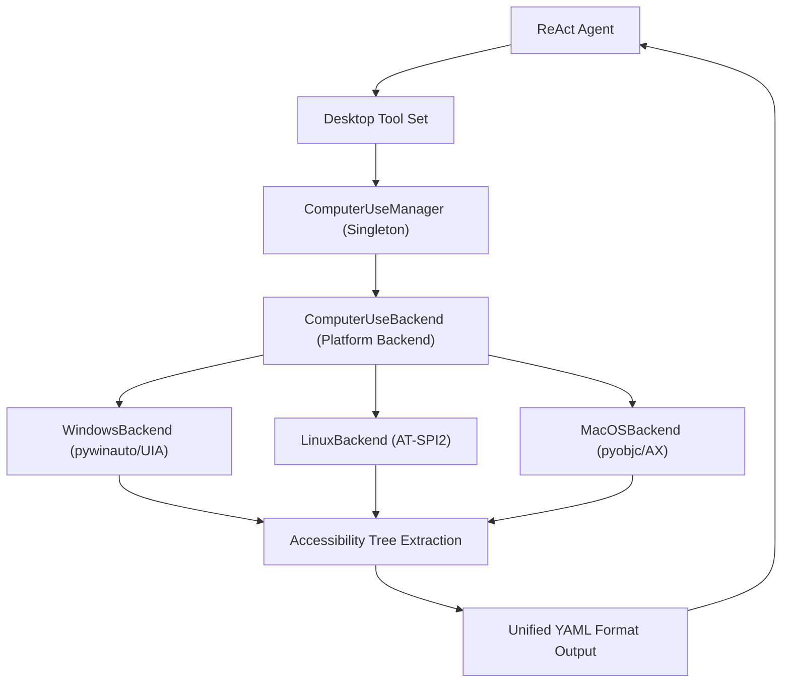
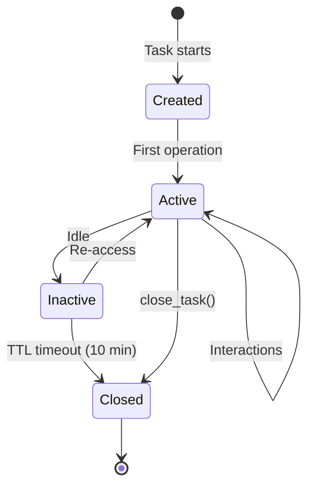

> **[中文](Computer-Use.md) | [English](Computer-Use.en.md)**

# Computer Use (Desktop Automation)

AgentNexus implements desktop application automation via OS-level accessibility APIs, supporting Windows (UIA), Linux (AT-SPI2), and macOS (AX). The LLM sees the same YAML-formatted element tree as browser mode, providing a unified interaction experience.

## Architecture Overview



## Platform Support

| Platform | Accessibility API | Python Dependency | System Requirement |
| --- | --- | --- | --- |
| Windows | UIA (pywinauto) | `pip install pywinauto` | Windows 8+ |
| Linux | AT-SPI2 (gi.repository.Atspi) | `apt install python3-gi gir1.2-atspi-2.0` | Xorg or Wayland |
| macOS | AX (pyobjc ApplicationServices) | `pip install pyobjc-framework-ApplicationServices` | Accessibility permission required |

The backend is selected via the `computer_use_backend` config option; default `auto` detects based on `sys.platform`.

### Windows Backend

- Uses pywinauto with UIA backend (`pywinauto.Desktop(backend="uia")`)
- Locates elements by AutomationId or name
- Key presses sent via `send_keys`, format: `{CTRL}s`
- Clipboard operations use pyperclip with Windows API fallback

### Linux Backend

- Uses AT-SPI2 accessibility interface (`gi.repository.Atspi`)
- Locates elements by AT-SPI path or name
- Key presses and text input sent via xdotool
- Clipboard operations use pyperclip with xclip fallback

### macOS Backend

- Uses pyobjc ApplicationServices (`AXUIElement` API)
- Locates elements by hierarchical path (e.g., `/AXWindow/AXGroup[0]/AXButton[1]`)
- Key presses sent via osascript (System Events)
- Right-click and scrolling use the cliclick tool
- **Note**: Requires granting Accessibility permission to the terminal app in System Settings > Privacy & Security > Accessibility

## Task Isolation & Lifecycle



- Each task has isolated state (focused window, last access time)
- Idle tasks are auto-reclaimed via TTL (default 10 minutes)
- Background coroutine checks every 60 seconds
- `close_task()` manually releases task state
- `close_all()` shuts down all resources and resets the singleton

## Unified Element Model (DesktopElement)

All platform accessibility elements are mapped to a unified `DesktopElement` dataclass:

| Property | Type | Description |
| --- | --- | --- |
| `role` | `str` | Unified role name (e.g., `button`, `textbox`, `window`) |
| `name` | `str` | Element name / accessible label |
| `value` | `str \| None` | Current value (text inputs, sliders, etc.) |
| `enabled` | `bool` | Whether the element is enabled |
| `focused` | `bool` | Whether the element has keyboard focus |
| `checked` | `bool \| None` | Checkbox/radio state |
| `bounds` | `tuple[int,int,int,int]` | Bounding rectangle `(x, y, width, height)` |
| `children` | `tuple[DesktopElement,...]` | Child elements |
| `platform_role` | `str` | Original platform role name (for debugging) |
| `platform_id` | `str` | Platform identifier (AutomationId, path, etc.) |

Role mapping examples:

| Unified Role | Windows UIA | Linux AT-SPI | macOS AX |
| --- | --- | --- | --- |
| `button` | `Button` | `push_button` | `AXButton` |
| `textbox` | `Edit` | `entry` | `AXTextField` |
| `checkbox` | `CheckBox` | `check_box` | `AXCheckBox` |
| `combobox` | `ComboBox` | `combo_box` | `AXPopUpButton` |
| `menuitem` | `MenuItem` | `menu_item` | `AXMenuItem` |
| `tab` | `TabItem` | `page_tab` | `AXTab` |
| `slider` | `Slider` | `slider` | `AXSlider` |
| `window` | `Window` | `frame` | `AXWindow` |
| `link` | `Hyperlink` | `link` | `AXLink` |
| `radio` | `RadioButton` | `radio_button` | `AXRadioButton` |

## Tool Set

| Tool | Function | Risk Level |
| --- | --- | --- |
| `computer_snapshot` | Get accessibility tree snapshot of a desktop window | LOW |
| `computer_list_windows` | List all visible windows | LOW |
| `computer_switch_window` | Switch to a specific window | LOW |
| `computer_launch` | Launch a desktop application | MEDIUM |
| `computer_click` | Click a desktop element | MEDIUM |
| `computer_type` | Type text into an input field | MEDIUM |
| `computer_key` | Press a key combination | LOW |
| `computer_select` | Select a value in a combobox | LOW |
| `computer_toggle` | Toggle checkbox/switch state | LOW |
| `computer_scroll` | Scroll a region or the screen | LOW |

### Tool Parameter Details

#### computer_snapshot

| Parameter | Type | Required | Default | Description |
| --- | --- | --- | --- | --- |
| `app_name` | `str` | No | `None` | Application name (partial match) |
| `window_title` | `str` | No | `None` | Window title (partial match) |
| `mode` | `str` | No | `"reading"` | Snapshot mode: `reading` / `interactive` / `full` |

When no window is specified, uses the currently focused window.

#### computer_list_windows

No parameters. Returns the index, application name, title, and position of all visible windows.

#### computer_switch_window

| Parameter | Type | Required | Default | Description |
| --- | --- | --- | --- | --- |
| `window_index` | `int` | No | `None` | Window index (from `computer_list_windows`) |
| `app_name` | `str` | No | `None` | Application name (partial match) |
| `window_title` | `str` | No | `None` | Window title (partial match) |

At least one parameter is required.

#### computer_launch

| Parameter | Type | Required | Default | Description |
| --- | --- | --- | --- | --- |
| `app_path` | `str` | **Yes** | - | Application path or name |
| `args` | `list[str]` | No | `None` | Command-line arguments |

Subject to app blocklist and allowlist restrictions.

#### computer_click

| Parameter | Type | Required | Default | Description |
| --- | --- | --- | --- | --- |
| `element_id` | `str` | **Yes** | - | Element identifier (from snapshot) |
| `button` | `str` | No | `"left"` | Mouse button: `left` / `right` / `middle` |
| `clicks` | `int` | No | `1` | Number of clicks: 1=single, 2=double |
| `role` | `str` | No | `None` | Element role (for HITL check) |
| `name` | `str` | No | `None` | Element name (for HITL check) |

#### computer_type

| Parameter | Type | Required | Default | Description |
| --- | --- | --- | --- | --- |
| `element_id` | `str` | **Yes** | - | Element identifier (from snapshot) |
| `text` | `str` | **Yes** | - | Text to input |
| `clear` | `bool` | No | `True` | Whether to clear the field first |
| `role` | `str` | No | `None` | Element role (for HITL check) |
| `name` | `str` | No | `None` | Element name (for HITL check) |

#### computer_key

| Parameter | Type | Required | Default | Description |
| --- | --- | --- | --- | --- |
| `keys` | `str` | **Yes** | - | Key combination string, e.g., `ctrl+s`, `alt+tab`, `enter` |

#### computer_select

| Parameter | Type | Required | Default | Description |
| --- | --- | --- | --- | --- |
| `element_id` | `str` | **Yes** | - | Element identifier |
| `value` | `str` | **Yes** | - | Value to select |
| `role` | `str` | No | `None` | Element role (for HITL check) |
| `name` | `str` | No | `None` | Element name (for HITL check) |

#### computer_toggle

| Parameter | Type | Required | Default | Description |
| --- | --- | --- | --- | --- |
| `element_id` | `str` | **Yes** | - | Element identifier |
| `checked` | `bool` | No | `None` | `true`=check, `false`=uncheck, `null`=toggle |
| `role` | `str` | No | `None` | Element role (for HITL check) |
| `name` | `str` | No | `None` | Element name (for HITL check) |

#### computer_scroll

| Parameter | Type | Required | Default | Description |
| --- | --- | --- | --- | --- |
| `element_id` | `str` | No | `None` | Element identifier; omit to scroll the screen |
| `direction` | `str` | No | `"down"` | Direction: `up` / `down` / `left` / `right` |
| `amount` | `int` | No | `3` | Number of scroll steps |

## Snapshot Modes

Desktop automation snapshot modes are consistent with browser mode, using the same YAML output format.

| Mode | Contains | Use Case |
| --- | --- | --- |
| `reading` (default) | Interactive elements + headings, status, text | Understanding window content |
| `interactive` | Interactive elements only (buttons, links, inputs, etc.) | Automation operations |
| `full` | Complete accessibility tree (YAML indented format) | Full analysis |

### Interactive Roles (INTERACTIVE_ROLES)

`button`, `link`, `textbox`, `searchbox`, `combobox`, `checkbox`, `radio`, `switch`, `slider`, `spinbutton`, `menuitem`, `menuitemcheckbox`, `menuitemradio`, `tab`, `option`, `scrollbar`, `tablist`, `dialog`, `alertdialog`, `splitbutton`

### Reading Roles (READING_ROLES)

Interactive roles + `heading`, `text`, `status`, `alert`, `log`, `marquee`, `timer`, `note`, `definition`, `progressbar`

### Output Format

**reading / interactive mode** (numbered format):

```text
[1] window "Notepad"
[2] menubar ""
[3] menuitem "File"
[4] textbox "Text area" [value="Hello"] [focused]
```

**full mode** (YAML indented format):

```yaml
- window "Notepad":
  - menubar "":
    - menuitem "File":
  - group "":
    - textbox "Text area" [value="Hello"] [focused]:
```

### Priority Truncation

When the accessibility tree exceeds the `max_nodes` limit, elements are truncated by priority:

1. **Interactive elements** (INTERACTIVE_ROLES) -- highest priority
2. **Reading elements** (READING_ROLES) -- medium priority
3. **Other elements** -- lowest priority

The `max_nodes` limit for full mode is 2x the configured value.

## HITL (Human-in-the-Loop) Rules

HITL rules block dangerous operations that require human confirmation. Configured via `computer_use_hitl_rules`.

### Rule Format

```yaml
computer_use_hitl_rules:
  - action: "click"
    role: "button"
    name_pattern: "pay|confirm delete|Submit"
  - action: "type"
    name_pattern: "password|密码"
```

### Matching Logic

Rules are evaluated in order; any match triggers HITL interception:

1. `action` (optional): Matches operation type (`click`, `type`, `key`, `select`, `toggle`)
2. `role` (optional): Matches element role
3. `name_pattern` (optional): Regex match against element name (case-insensitive)

### Blocked Operations

When a HITL rule matches, the operation returns an error:

```text
ERROR: Operation blocked by HITL rules
DETAIL: click on button 'Pay'
HINT: Requires user confirmation before execution
```

## App Blocklist / Allowlist

Configuration options control which applications can be automated.

### Blocklist (computer_use_blocked_apps)

Default blocked applications:

```yaml
computer_use_blocked_apps:
  - taskmgr       # Task Manager
  - regedit       # Registry Editor
  - cmd           # Command Prompt
  - powershell    # PowerShell
  - terminal      # Terminal
```

Blocklist checks are enforced during `launch_app` operations, using substring matching (case-insensitive).

### Allowlist (computer_use_allowed_apps)

```yaml
computer_use_allowed_apps: []  # Empty = all apps allowed
computer_use_allowed_apps:
  - notepad
  - calculator
  - chrome
```

Allowlist checks are enforced during `launch_app` operations. An empty list means all applications are permitted.

## Configuration Reference

```yaml
# Desktop automation configuration
computer_use_enabled: false          # Enable feature (disabled by default)
computer_use_backend: "auto"         # Backend: auto/windows/linux/macos
computer_use_snapshot_max_nodes: 100 # Max snapshot nodes (10-1000)

# Security configuration
computer_use_hitl_rules: []          # HITL trigger rule list
computer_use_allowed_apps: []        # Allowed apps allowlist (empty = all allowed)
computer_use_blocked_apps:           # Blocked apps blocklist
  - taskmgr
  - regedit
  - cmd
  - powershell
  - terminal
```

## Comparison with Browser Automation

| Feature | Browser Automation | Desktop Automation |
| --- | --- | --- |
| **Target** | Web pages | Desktop applications |
| **Underlying Technology** | Playwright (CDP) | OS Accessibility APIs |
| **Element Extraction** | Browser accessibility tree | Desktop accessibility tree (UIA/AT-SPI/AX) |
| **Output Format** | YAML numbered/indented | Same YAML format |
| **Operating Modes** | Isolated / CDP | None (direct target app operation) |
| **Task Isolation** | Per-task independent Page | Per-task focused window state |
| **Screenshots** | Supported | Not supported |
| **JS Execution** | Optional | Not applicable |
| **Multi-window** | Multiple Pages | Window switching |
| **Config Namespace** | `browser_*` | `computer_use_*` |

### Core Consistency

Both modules share the same design patterns:

- **Singleton Manager**: `BrowserManager` / `ComputerUseManager`
- **Async Background Event Loop**: `_run_async()` sync wrapper
- **Unified Element Model**: Browser uses Playwright `aria_snapshot`, desktop uses `DesktopElement`, with identical output format
- **TTL Auto-reclaim**: Idle tasks are automatically cleaned up
- **HITL Rules**: Dangerous operation interception mechanism
- **Priority Truncation**: Elements truncated by role importance when node limits are exceeded

## Troubleshooting

| Problem | Cause | Solution |
| --- | --- | --- |
| `Desktop automation not enabled` | `computer_use_enabled` is false | Set `computer_use_enabled: true` in config |
| `pywinauto not installed` | Missing Windows dependency | `pip install pywinauto` |
| `AT-SPI2 not installed` | Missing Linux dependency | `apt install python3-gi gir1.2-atspi-2.0` |
| `pyobjc-framework-ApplicationServices not installed` | Missing macOS dependency | `pip install pyobjc-framework-ApplicationServices` |
| `Accessibility permission not granted` | macOS not authorized | System Settings > Privacy & Security > Accessibility > authorize terminal |
| `Element not found` | Element not in accessibility tree | Use `computer_snapshot` to confirm element exists |
| `App is blocklisted` | App blocked by blocklist | Adjust `computer_use_blocked_apps` config |
| `Operation blocked by HITL rules` | HITL rule matched | Adjust `computer_use_hitl_rules` or have user confirm |

> See [Tool Governance](Tool-Governance.en.md) for security gates, [Configuration](Configuration.en.md) for all config items.
