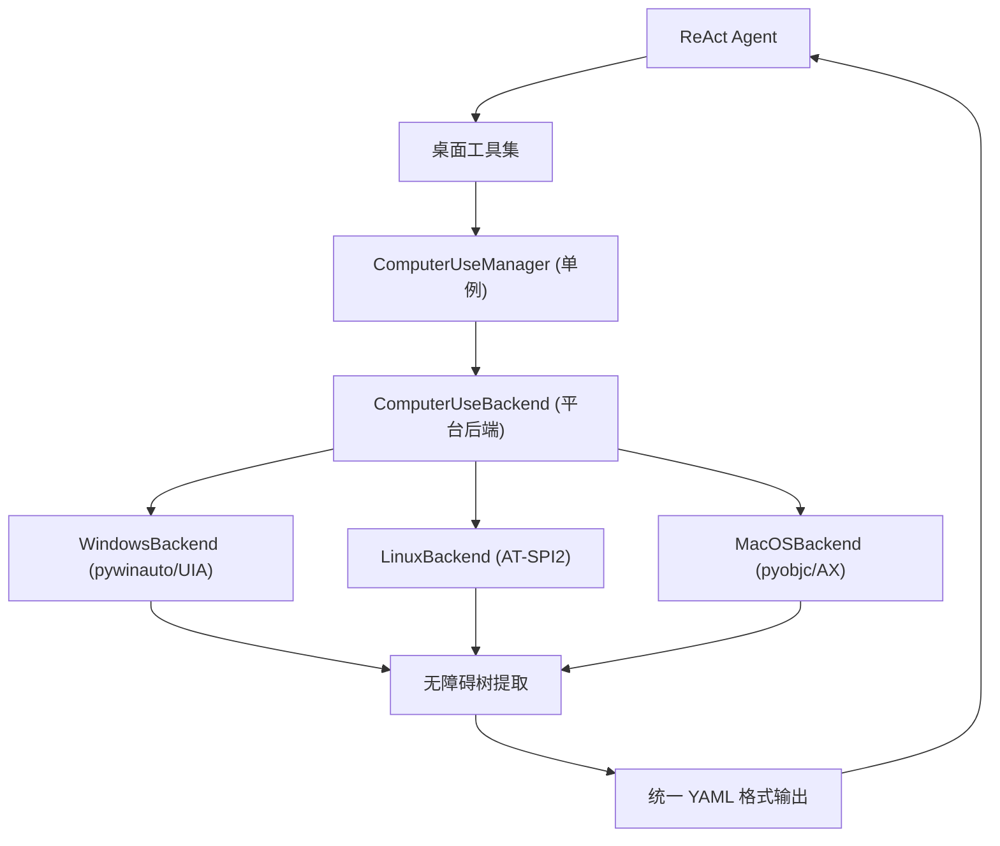
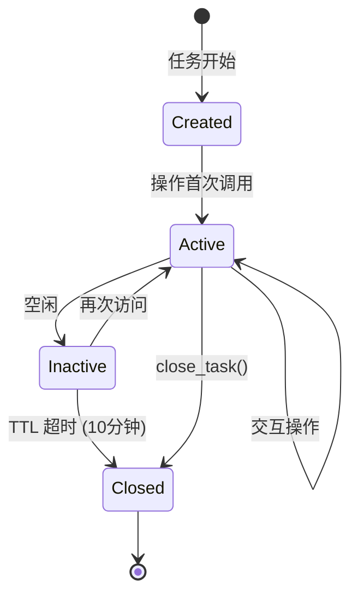

> **[中文](Computer-Use.md) | [English](Computer-Use.en.md)**

# 桌面自动化 (Computer Use)

AgentNexus 通过操作系统级无障碍 API 实现桌面应用自动化，支持 Windows (UIA)、Linux (AT-SPI2) 和 macOS (AX) 三大平台。LLM 看到的元素树格式与浏览器模式一致（YAML），实现统一的交互体验。

## 架构概览



## 平台支持

| 平台 | 无障碍 API | Python 依赖 | 系统要求 |
| --- | --- | --- | --- |
| Windows | UIA (pywinauto) | `pip install pywinauto` | Windows 8+ |
| Linux | AT-SPI2 (gi.repository.Atspi) | `apt install python3-gi gir1.2-atspi-2.0` | Xorg 或 Wayland |
| macOS | AX (pyobjc ApplicationServices) | `pip install pyobjc-framework-ApplicationServices` | 需授权辅助功能权限 |

后端通过 `computer_use_backend` 配置项选择，默认 `auto` 根据 `sys.platform` 自动检测。

### Windows 后端

- 使用 pywinauto 的 UIA 后端（`pywinauto.Desktop(backend="uia")`）
- 通过 AutomationId 或名称定位元素
- 按键通过 `send_keys` 发送，格式：`{CTRL}s`
- 剪贴板操作使用 pyperclip，回退到 Windows API

### Linux 后端

- 使用 AT-SPI2 无障碍接口（`gi.repository.Atspi`）
- 通过 AT-SPI path 或名称定位元素
- 按键和输入通过 xdotool 发送
- 剪贴板操作使用 pyperclip，回退到 xclip

### macOS 后端

- 使用 pyobjc ApplicationServices（`AXUIElement` API）
- 通过层级路径（如 `/AXWindow/AXGroup[0]/AXButton[1]`）定位元素
- 按键通过 osascript（System Events）发送
- 右键和滚动使用 cliclick 工具
- **注意**：需要在「系统设置 > 隐私与安全性 > 辅助功能」中授权终端应用

## 任务隔离与生命周期



- 每个任务有独立的状态（聚焦窗口、最后访问时间）
- 空闲任务通过 TTL 自动回收（默认 10 分钟）
- 后台协程每 60 秒检查一次过期任务
- `close_task()` 可手动释放任务状态
- `close_all()` 关闭所有资源并重置单例

## 统一元素模型 (DesktopElement)

所有平台的无障碍元素统一映射为 `DesktopElement` 数据类：

| 属性 | 类型 | 说明 |
| --- | --- | --- |
| `role` | `str` | 统一角色名（如 `button`、`textbox`、`window`） |
| `name` | `str` | 元素名称 / 可访问标签 |
| `value` | `str \| None` | 当前值（输入框、滑块等） |
| `enabled` | `bool` | 是否可用 |
| `focused` | `bool` | 是否拥有键盘焦点 |
| `checked` | `bool \| None` | 复选框/单选框状态 |
| `bounds` | `tuple[int,int,int,int]` | 边界矩形 `(x, y, width, height)` |
| `children` | `tuple[DesktopElement,...]` | 子元素 |
| `platform_role` | `str` | 原始平台角色名（调试用） |
| `platform_id` | `str` | 平台标识符（AutomationId、path 等） |

角色映射示例：

| 统一角色 | Windows UIA | Linux AT-SPI | macOS AX |
| --- | --- | --- | --- |
| `button` | `Button` | `push_button` | `AXButton` |
| `textbox` | `Edit` | `entry` | `AXTextField` |
| `checkbox` | `CheckBox` | `check_box` | `AXCheckBox` |
| `combobox` | `ComboBox` | `combo_box` | `AXPopUpButton` |
| `menuitem` | `MenuItem` | `menu_item` | `AXMenuItem` |
| `tab` | `TabItem` | `page_tab` | `AXTab` |
| `slider` | `Slider` | `slider` | `AXSlider` |
| `window` | `Window` | `frame` | `AXWindow` |
| `link` | `Hyperlink` | `link` | `AXLink` |
| `radio` | `RadioButton` | `radio_button` | `AXRadioButton` |

## 工具集

| 工具 | 功能 | 风险等级 |
| --- | --- | --- |
| `computer_snapshot` | 获取桌面窗口的无障碍树快照 | LOW |
| `computer_list_windows` | 列出所有可见窗口 | LOW |
| `computer_switch_window` | 切换到指定窗口 | LOW |
| `computer_launch` | 启动桌面应用 | MEDIUM |
| `computer_click` | 点击桌面元素 | MEDIUM |
| `computer_type` | 在输入框中键入文本 | MEDIUM |
| `computer_key` | 按下键组合 | LOW |
| `computer_select` | 在下拉框中选择值 | LOW |
| `computer_toggle` | 切换复选框/开关状态 | LOW |
| `computer_scroll` | 滚动指定区域或屏幕 | LOW |

### 工具参数详情

#### computer_snapshot

| 参数 | 类型 | 必填 | 默认值 | 说明 |
| --- | --- | --- | --- | --- |
| `app_name` | `str` | 否 | `None` | 应用名（部分匹配） |
| `window_title` | `str` | 否 | `None` | 窗口标题（部分匹配） |
| `mode` | `str` | 否 | `"reading"` | 快照模式：`reading` / `interactive` / `full` |

不指定窗口时使用当前聚焦窗口。

#### computer_list_windows

无参数。返回所有可见窗口的索引、应用名、标题和位置。

#### computer_switch_window

| 参数 | 类型 | 必填 | 默认值 | 说明 |
| --- | --- | --- | --- | --- |
| `window_index` | `int` | 否 | `None` | 窗口索引（从 `computer_list_windows` 获取） |
| `app_name` | `str` | 否 | `None` | 应用名（部分匹配） |
| `window_title` | `str` | 否 | `None` | 窗口标题（部分匹配） |

至少提供一个参数。

#### computer_launch

| 参数 | 类型 | 必填 | 默认值 | 说明 |
| --- | --- | --- | --- | --- |
| `app_path` | `str` | **是** | - | 应用路径或名称 |
| `args` | `list[str]` | 否 | `None` | 命令行参数 |

受应用黑名单和白名单限制。

#### computer_click

| 参数 | 类型 | 必填 | 默认值 | 说明 |
| --- | --- | --- | --- | --- |
| `element_id` | `str` | **是** | - | 元素标识（从 snapshot 获取） |
| `button` | `str` | 否 | `"left"` | 鼠标按钮：`left` / `right` / `middle` |
| `clicks` | `int` | 否 | `1` | 点击次数：1=单击，2=双击 |
| `role` | `str` | 否 | `None` | 元素角色（HITL 检查用） |
| `name` | `str` | 否 | `None` | 元素名称（HITL 检查用） |

#### computer_type

| 参数 | 类型 | 必填 | 默认值 | 说明 |
| --- | --- | --- | --- | --- |
| `element_id` | `str` | **是** | - | 元素标识（从 snapshot 获取） |
| `text` | `str` | **是** | - | 要输入的文本 |
| `clear` | `bool` | 否 | `True` | 是否先清空输入框 |
| `role` | `str` | 否 | `None` | 元素角色（HITL 检查用） |
| `name` | `str` | 否 | `None` | 元素名称（HITL 检查用） |

#### computer_key

| 参数 | 类型 | 必填 | 默认值 | 说明 |
| --- | --- | --- | --- | --- |
| `keys` | `str` | **是** | - | 键组合字符串，如 `ctrl+s`、`alt+tab`、`enter` |

#### computer_select

| 参数 | 类型 | 必填 | 默认值 | 说明 |
| --- | --- | --- | --- | --- |
| `element_id` | `str` | **是** | - | 元素标识 |
| `value` | `str` | **是** | - | 要选择的值 |
| `role` | `str` | 否 | `None` | 元素角色（HITL 检查用） |
| `name` | `str` | 否 | `None` | 元素名称（HITL 检查用） |

#### computer_toggle

| 参数 | 类型 | 必填 | 默认值 | 说明 |
| --- | --- | --- | --- | --- |
| `element_id` | `str` | **是** | - | 元素标识 |
| `checked` | `bool` | 否 | `None` | `true`=勾选，`false`=取消，`null`=切换 |
| `role` | `str` | 否 | `None` | 元素角色（HITL 检查用） |
| `name` | `str` | 否 | `None` | 元素名称（HITL 检查用） |

#### computer_scroll

| 参数 | 类型 | 必填 | 默认值 | 说明 |
| --- | --- | --- | --- | --- |
| `element_id` | `str` | 否 | `None` | 元素标识，不指定则滚动屏幕 |
| `direction` | `str` | 否 | `"down"` | 方向：`up` / `down` / `left` / `right` |
| `amount` | `int` | 否 | `3` | 滚动步数 |

## 快照模式

桌面自动化的快照模式与浏览器模式保持一致，使用相同的 YAML 格式输出。

| 模式 | 包含元素 | 适用场景 |
| --- | --- | --- |
| `reading`（默认） | 可交互元素 + 标题、状态、文本等阅读元素 | 了解窗口内容 |
| `interactive` | 仅可交互元素（按钮、链接、输入框等） | 自动化操作 |
| `full` | 完整的无障碍树（YAML 缩进格式） | 完整分析 |

### 可交互角色 (INTERACTIVE_ROLES)

`button`, `link`, `textbox`, `searchbox`, `combobox`, `checkbox`, `radio`, `switch`, `slider`, `spinbutton`, `menuitem`, `menuitemcheckbox`, `menuitemradio`, `tab`, `option`, `scrollbar`, `tablist`, `dialog`, `alertdialog`, `splitbutton`

### 阅读角色 (READING_ROLES)

交互角色 + `heading`, `text`, `status`, `alert`, `log`, `marquee`, `timer`, `note`, `definition`, `progressbar`

### 输出格式

**reading / interactive 模式**（编号格式）：

```text
[1] window "记事本"
[2] menubar ""
[3] menuitem "文件"
[4] textbox "文本编辑区" [value="Hello"] [focused]
```

**full 模式**（YAML 缩进格式）：

```yaml
- window "记事本":
  - menubar "":
    - menuitem "文件":
  - group "":
    - textbox "文本编辑区" [value="Hello"] [focused]:
```

### 优先级截断

当无障碍树节点超过 `max_nodes` 限制时，按优先级截断：

1. **交互元素**（INTERACTIVE_ROLES）— 最高优先级
2. **阅读元素**（READING_ROLES）— 中等优先级
3. **其他元素** — 最低优先级

full 模式的 `max_nodes` 为配置值的 2 倍。

## HITL (Human-in-the-Loop) 规则

HITL 规则用于阻止需要人工确认的危险操作。通过 `computer_use_hitl_rules` 配置。

### 规则格式

```yaml
computer_use_hitl_rules:
  - action: "click"
    role: "button"
    name_pattern: "支付|确认删除|Submit"
  - action: "type"
    name_pattern: "password|密码"
```

### 匹配逻辑

规则按顺序匹配，任一规则匹配即触发 HITL 拦截：

1. `action`（可选）：匹配操作类型（`click`、`type`、`key`、`select`、`toggle`）
2. `role`（可选）：匹配元素角色
3. `name_pattern`（可选）：正则匹配元素名称（忽略大小写）

### 被拦截的操作

当 HITL 规则匹配时，操作返回错误：

```text
ERROR: 操作被 HITL 规则阻止
DETAIL: click on button '支付'
HINT: 需要用户确认后才能执行
```

## 应用黑白名单

通过配置项控制哪些应用可以被自动化操作。

### 黑名单 (computer_use_blocked_apps)

默认禁止的应用：

```yaml
computer_use_blocked_apps:
  - taskmgr       # 任务管理器
  - regedit       # 注册表编辑器
  - cmd           # 命令提示符
  - powershell    # PowerShell
  - terminal      # 终端
```

黑名单检查在 `launch_app` 操作时执行，匹配方式为子字符串（不区分大小写）。

### 白名单 (computer_use_allowed_apps)

```yaml
computer_use_allowed_apps: []  # 空列表 = 全部允许
computer_use_allowed_apps:
  - notepad
  - calculator
  - chrome
```

白名单检查在 `launch_app` 操作时执行。空列表表示所有应用均可操作。

## 配置参考

```yaml
# 桌面自动化配置
computer_use_enabled: false          # 是否启用（默认关闭）
computer_use_backend: "auto"         # 后端: auto/windows/linux/macos
computer_use_snapshot_max_nodes: 100 # 快照最大节点数 (10-1000)

# 安全配置
computer_use_hitl_rules: []          # HITL 触发规则列表
computer_use_allowed_apps: []        # 允许的应用白名单（空=全部允许）
computer_use_blocked_apps:           # 禁止的应用黑名单
  - taskmgr
  - regedit
  - cmd
  - powershell
  - terminal
```

## 与浏览器自动化的对比

| 特性 | 浏览器自动化 | 桌面自动化 |
| --- | --- | --- |
| **目标** | Web 页面 | 桌面应用 |
| **底层技术** | Playwright (CDP) | 操作系统无障碍 API |
| **元素提取** | 浏览器无障碍树 | 桌面无障碍树 (UIA/AT-SPI/AX) |
| **输出格式** | YAML 编号/缩进 | 相同的 YAML 格式 |
| **运行模式** | Isolated / CDP | 无（直接操作目标应用） |
| **任务隔离** | 每任务独立 Page | 每任务独立聚焦窗口状态 |
| **截图** | 支持 | 不支持 |
| **JS 执行** | 可选 | 不适用 |
| **多窗口** | 多 Page | 多窗口切换 |
| **配置入口** | `browser_*` | `computer_use_*` |

### 核心一致性

两个模块共享相同的设计模式：

- **单例管理器**：`BrowserManager` / `ComputerUseManager`
- **异步后台事件循环**：`_run_async()` 同步包装
- **统一元素模型**：浏览器使用 Playwright `aria_snapshot`，桌面使用 `DesktopElement`，输出格式一致
- **TTL 自动回收**：空闲任务自动清理
- **HITL 规则**：危险操作拦截机制
- **优先级截断**：超过节点限制时按角色重要性截断

## 故障排除

| 问题 | 原因 | 解决方案 |
| --- | --- | --- |
| `桌面自动化功能未启用` | `computer_use_enabled` 为 false | 在配置中设置 `computer_use_enabled: true` |
| `pywinauto 未安装` | 缺少 Windows 依赖 | `pip install pywinauto` |
| `AT-SPI2 未安装` | 缺少 Linux 依赖 | `apt install python3-gi gir1.2-atspi-2.0` |
| `pyobjc-framework-ApplicationServices 未安装` | 缺少 macOS 依赖 | `pip install pyobjc-framework-ApplicationServices` |
| `未授权辅助功能权限` | macOS 未授权 | 系统设置 > 隐私与安全性 > 辅助功能 > 授权终端 |
| `找不到元素` | 元素不在无障碍树中 | 先用 `computer_snapshot` 确认元素存在 |
| `应用在黑名单中` | 应用被黑名单拦截 | 调整 `computer_use_blocked_apps` 配置 |
| `操作被 HITL 规则阻止` | 匹配了 HITL 规则 | 调整 `computer_use_hitl_rules` 或由用户确认 |

> 见 [工具治理](Tool-Governance.md) 了解安全关卡，[配置参考](Configuration.md) 了解所有配置项。
