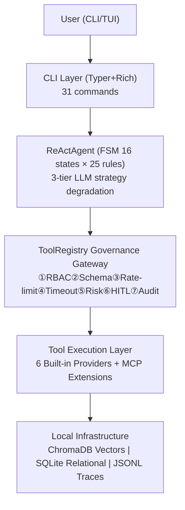

> **[中文](Home.md) | [English](Home.en.md)**

# 🏠 AgentNexus

**ReAct Single-Agent Task Collaboration CLI** — Fully local, production-ready.

AgentNexus combines LLM reasoning with 12 built-in tools, executing complex tasks through an FSM-driven safety loop. All data (vector store, memory, trace logs) stays entirely local.

## Core Capabilities

| Capability | Description |
|------|-----------|
| **Conversation & Tasks** | TUI interface with ReAct loop: plan→execute→observe |
| **Local Memory** | STM compression pyramid + LTM dual storage (embedding+structured), score-based eviction |
| **Knowledge Base RAG** | Dense+sparse+RRF+rerank hybrid retrieval, 8 formats |
| **Security Sandbox** | E2B → bubblewrap/Seatbelt → Docker → local fallback |
| **Tool Audit** | 7 security gates, fully traceable |
| **Observability** | Trace tree + Token costs + Audit logs |
| **Evaluation** | 8 evaluators, CI mode gating |
| **Skill Workflow** | Reusable templates, TF-IDF auto-routing |
| **MCP Integration** | External tools with full governance |
| **Sub-agents** | Agent-in-Agent isolated delegation |

## Quick Links

- [🚀 Getting Started](Getting-Started.en.md)
- [⌨ Commands](Commands.en.md)
- [⚙ Configuration](Configuration.en.md)
- [🏗 Architecture](Architecture.en.md)
