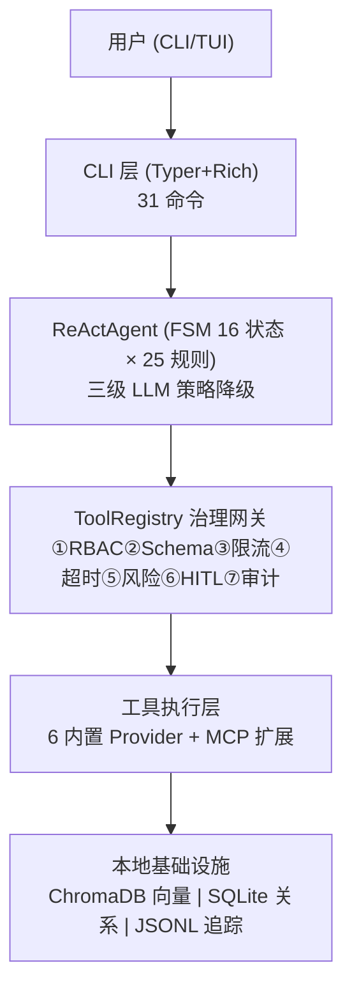

# 🏠 AgentNexus

**ReAct 单智能体任务协同 CLI** — 纯本地运行，生产就绪。

AgentNexus 将 LLM 的推理能力与 12 种内置工具结合，通过 FSM 驱动的安全循环完成复杂任务。所有数据（向量库、记忆、追踪日志）全部留在本地。

## 核心能力

| 能力 | 一句话描述 |
|------|-----------|
| **对话与任务** | TUI 交互界面，ReAct 循环自动规划→执行→观察 |
| **本地记忆** | STM 压缩金字塔 + LTM 双存储（嵌入+结构），评分驱逐 |
| **知识库 RAG** | 稠密+稀疏+RRF+重排序混合检索，8 种格式 |
| **安全沙箱** | E2B → bubblewrap/Seatbelt → Docker → 本地兜底 |
| **工具审计** | 7 道安全关卡，每步可追溯 |
| **可观测性** | Trace 树 + Token 成本 + 审计日志 |
| **评估体系** | 8 个评估器，CI 模式门控 |
| **Skill 工作流** | 可复用模板，TF-IDF 自动路由 |
| **MCP 集成** | 外部工具全治理接入 |
| **子代理** | Agent-in-Agent 隔离委派 |

## 快速链接

- [🚀 快速开始](Getting-Started.md)
- [⌨ 命令速查](Commands.md)
- [⚙ 配置参考](Configuration.md)
- [🏗 完整架构](Architecture.md)
